❤️ Support Development

If you are enjoying Fablecraft and want to help keep development moving, please consider supporting the project through Buy Me a Coffee:buymeacoffee.com/k8ffh48yvkeDevelopment costs have started to rise, and I want to keep improving this project to give players the experience I always dreamed of when I first started it almost fifteen years ago. Any contribution is deeply appreciated and goes directly toward funding the tools needed to continue active development of this mod project. I've honestly spent way too much money developing this... 😅

# ⚔ Fablecraft: Reforged

**Transform Minecraft Bedrock into Albion.** A complete recreation of *Fable: The Lost Chapters* as a single `.mcaddon` — Hero XP paths with coloured experience orbs, a living morality system, faction reputation, Will powers, Cullis Gate fast travel, a full mining-and-smithing economy, Demon Doors that talk back, legendary weapons, armour sets, quest chains, Twinblade's war-camps, and Jack of Blades waiting at the end of it all.

> Every texture, model, structure, sound and screenshot in this repository is **procedurally generated from code** — Python paints the pixels, builds the geometry, synthesizes the audio and renders the 3D scenes you see below.


| | | | | | | | | |
|---|---|---|---|---|---|---|---|---|
| **45** creatures | **185** items | **122** recipes | **17** Will powers | **14** quests | **8** Demon Doors | **9** structures | **5** factions | **7** sounds |

---

## 📥 Installing

1. Grab **`dist/Fablecraft_Reforged.mcaddon`**.
2. Double-click it (or open it with Minecraft). Both packs import automatically.
3. Create a new world → **Add** the Behavior Pack *Fablecraft: Reforged [Behavior]* (the Resource Pack joins automatically as a dependency).
4. Under world settings, ensure **Holiday Creator Features / Beta APIs** toggles required by your Minecraft version are enabled for scripting.
5. Spawn in. You wake **inside the Heroes' Guild** kitted out in a full apprentice outfit, a Stick, your Guild Seal, a Quest Card and an Apple Pie — the Guildmaster is expecting you.

> Prefer separate packs? `dist/Fablecraft_BP.mcpack` and `dist/Fablecraft_RP.mcpack` install individually.

**Requirements:** Minecraft Bedrock **1.21.90+** (Windows / mobile / console via realm host), with the Script API enabled (`@minecraft/server` 1.19, `@minecraft/server-ui` 1.3).

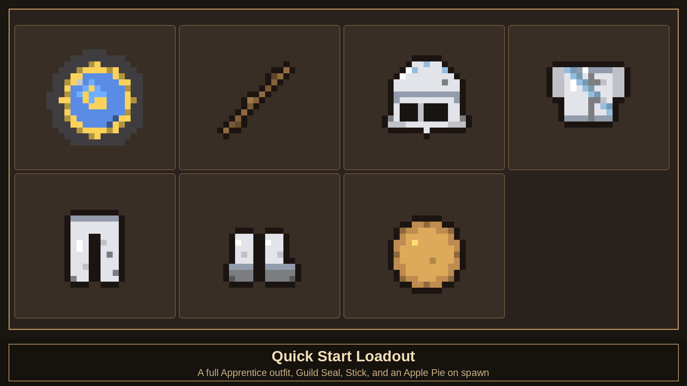

---

## 🧙 Hero Systems


### Experience & Training

Kills grant **General XP** plus **Strength** (melee) or **Skill** (ranged) XP; casting grants **Will XP**. Your **Combat Multiplier** climbs with every unanswered hit and multiplies XP gains — take damage and it shatters, exactly as the Guild taught you. Slain foes also shed **experience orbs** in Fable's colours — green (General), red (Strength), yellow (Skill) and blue (Will) — crush them to absorb bonus experience. Bosses burst with them.

Training happens **at the Guild**: the **Training Grounds** fill the east yard (archery range, sparring ring, Will circle) and the Map Room holds the Guildmaster. Spend XP on **Physique, Health, Toughness, Speed, Guile, Accuracy** and **Magic Power**.

The **Hero Menu** (use your Guild Seal) is your command centre: your active quest and Will energy at a glance, then Stats & Personality, Quest Log, **Weapon Locker** (inspect your wielded weapon's augment slots), **Map of Albion** (Cullis Gate fast travel), Guild Training, Will Powers, Titles & Renown, and Factions & Standing.


### Morality, Factions & Renown

Slay monsters, escort traders and spare the innocent to shine; murder villagers, drain life and eat **Crunchy Chicks** to rot. Morality runs **-1000 … +1000**, gates spells (Divine Fury vs. Infernal Wrath), changes NPC dialogue, alters Demon Door verdicts, and wreaths you in golden light or black smoke. Titles run from **Paragon** to **Avatar of Skorm**.

Five factions keep a ledger on you: **the Guild, Bowerstone, Oakvale, Snowspire** and **Twinblade's Bandits**. Clearing bandit camps raises your standing with the towns; cutting down guards or villagers wrecks it. Reputation bends shop prices by up to 20% either way — and a town that marks you **hostile** will have its guards attack on sight. Fame from Renown buys better quests and villager adoration… and night-time assassin ambushes. Nothing in Albion is free.

### The Cullis Gate

The west yard of the Guild holds a humming **Cullis Gate** — Fable's teleport network. Step onto the ring and **sneak** to open the travel menu. Every **Focus Site** you discover in the wild joins the lattice, letting you blink across Albion.

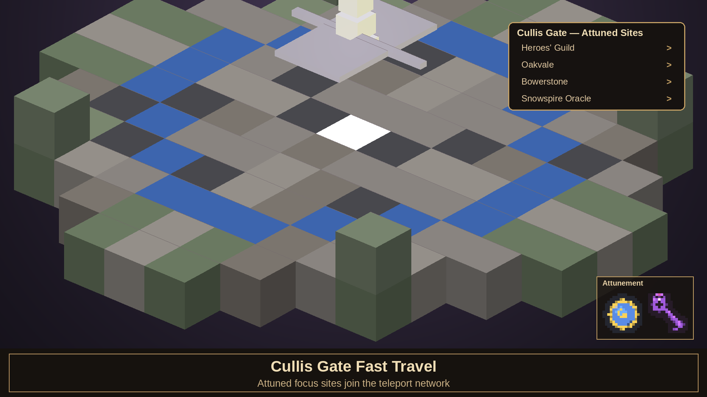

### The Final Choice

Defeat Jack of Blades and his dragon form, and the **Sword of Aeons** is yours. Keep it and rule through fear — or cast it away and receive **Avo's Tear**. The classic ending, your call.

---

## ⛏ Forge & Progression

Everything you can wear or swing is **craftable**, with a smithing chain that makes Albion-sense:

| Material | How to get it |
|---|---|
| **Iron** | Vanilla iron — the apprentice's metal |
| **Steel Ingot** | Fold 2 iron ingots over coal at a crafting table |
| **Obsidian Ingot** | Smelt a block of obsidian in any furnace — volcanic glass drawn molten |
| **Will Shard** | Mine glowing **azurite ore**, seeded through the deep underground (y 4–54) |
| **Master Ingot** | Quench a steel ingot in two Will Shards — steel remembers the magic |

Weapons follow classic patterns (longswords, katanas, cleavers, axes, maces, pickhammers, greatweapons), bows are bound from planks, string and a tier ingot, and all 13 armour sets craft from themed materials — chainmail from chains, guard uniforms from steel and town-colour wool, the Archon's set from Master ingots and gold.


### Crafting in Action

122 recipes cover every outfit, weapon and tool — fold steel from iron and coal, smelt obsidian ingots from obsidian, quench Master ingots in Will Shards mined from azurite ore.


All 122 recipe diagrams live in [screenshots/recipes](screenshots/recipes).

### Legendary Arsenal & Augments

Sword of Aeons · Avo's Tear · The Harbinger · Solus Greatsword · The Bereaver · Avenger · Katana Hiryu · Orkon's Club · Dollmaster's Mace · Wellow's Pickhammer · Arken's Crossbow · Skorm's Bow · Scimitar · and the humble **Stick**.

Weapons carry **augment slots** (Steel 1 / Obsidian 2 / Master 3). Bind **Sharpening, Piercing, Health, Mana, Experience, Lightning, Flame** or **Silver** augmentations — forged by binding monster trophies to Will Shards: a Balverine fang and silver-bright iron make a Silver augmentation; a Troll heart makes Health; a Banshee's tear crackles into Lightning. Silver burns Balverines and the undead, exactly as the bestiaries warn.

Using an augmentation stone opens the **Augmentation Forge** — pick which weapon in your pack receives the power from a list of every eligible blade and its filled/empty slots. Binding (or stripping, via the Augment Remover) wreathes the weapon in a burst of totem light and power-coloured sparks with a ringing anvil strike, and augmented weapons carry a faint, drifting aura of their bound colours while held.

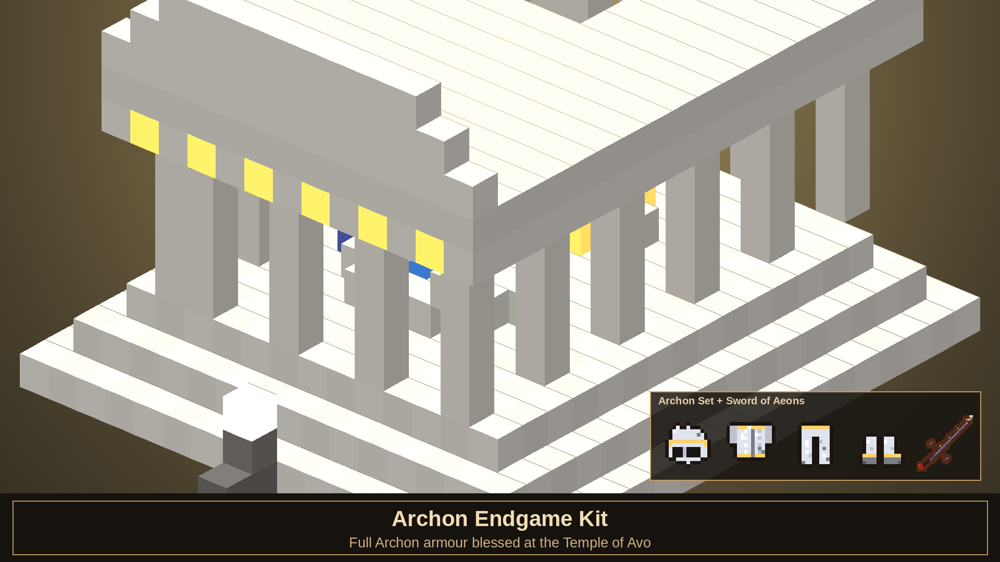
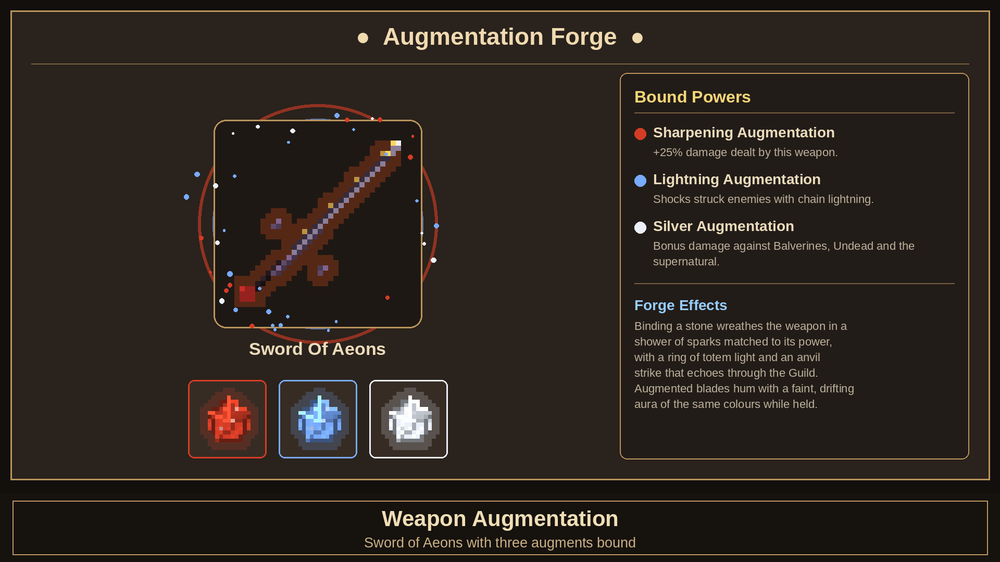


### Armour Sets

From apprentice hood to Archon plate, the addon includes 13 armour sets across 58 pieces, all attached as you equip them.

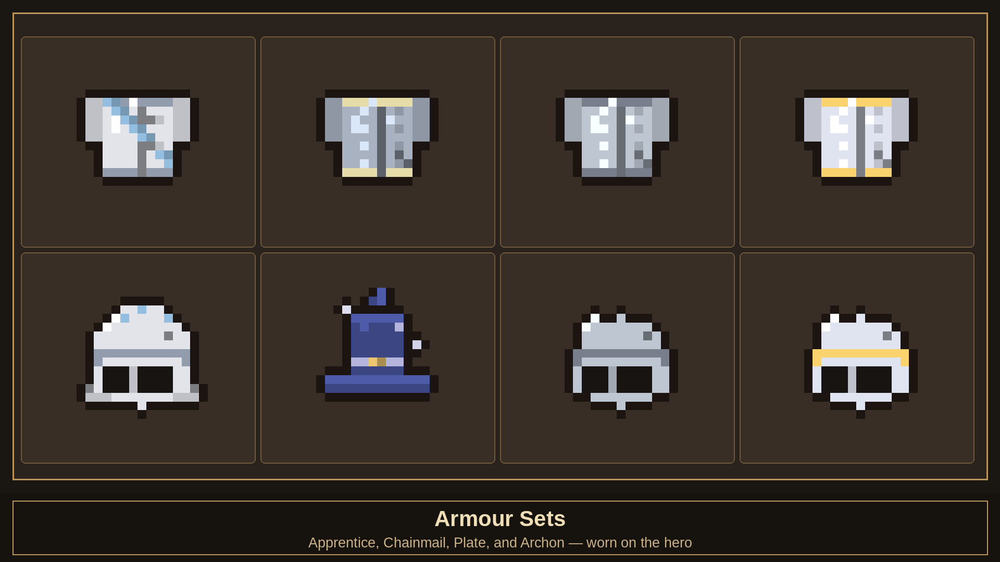


---

## 🚪 Demon Doors & Structures

Eight ancient doors are scattered across the world, each a living stone face carved into a **hillside crag** that rises out of the landscape — the placement engine even hunts for naturally sloping ground so every door looks like it has been there for a thousand years. Speak to them. Flatter them. Feed them. One wants five apple pies. One wants to see a Combat Multiplier of 14 mid-battle. One asks a riddle and laughs at you for a century if you miss it. Behind each: legendary weapons, silver keys, elixirs.


Beyond the doors, **9 structures** dot Albion — the walled Heroes' Guild (Cullis Gate + training grounds), the Arena, Temple of Avo, Chapel of Skorm, Twinblade's palisaded war-camp, Lychfield graveyard, focus sites, silver-chest ruins and Demon Door crags — all stocked with **lootable chests** and blended into the terrain.

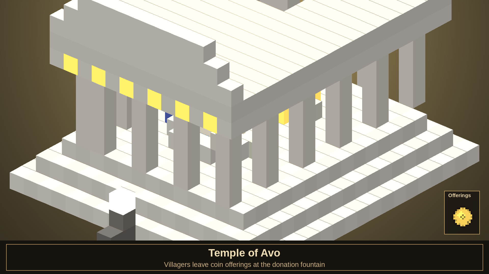


---

## 👹 Bestiary & Encounters

**45 creatures**: Balverines (standard/White/Frost), Trolls (Earth/Ice/Rock Giant), Hobbes, Bandits and **Twinblade the Bandit King**, Hollow Men in three states of decay (shambler, soldier, knight), Wasps & Wasp Queen, Wraiths, Banshees, Summoners, Minions, Arachanox, Assassins, Nymphs and summoned allies.

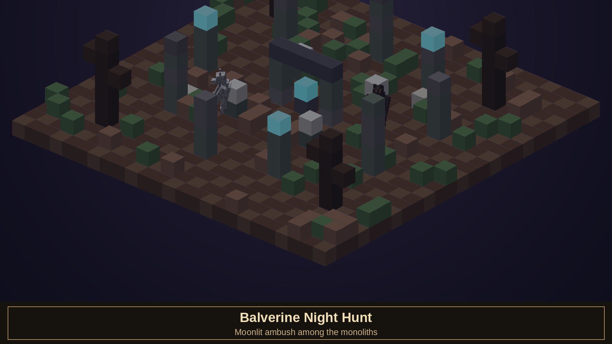
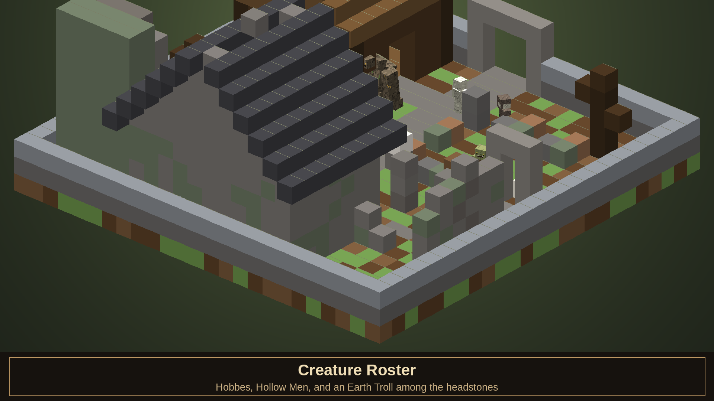

### Will Powers in the Field

**17 Will powers** — Fireball, Enflame, Lightning, Slow Time, Assassin Rush, Summon, Berserk, Divine Fury, Infernal Wrath and more — each with 4 upgrade levels.

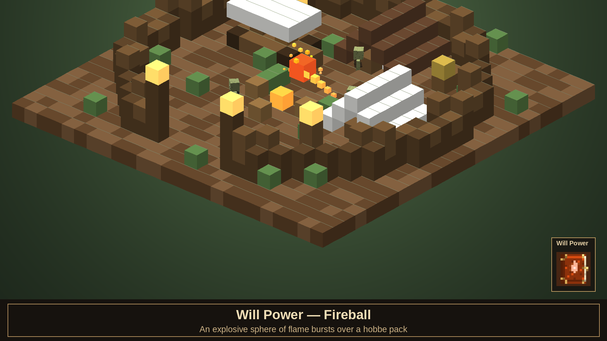
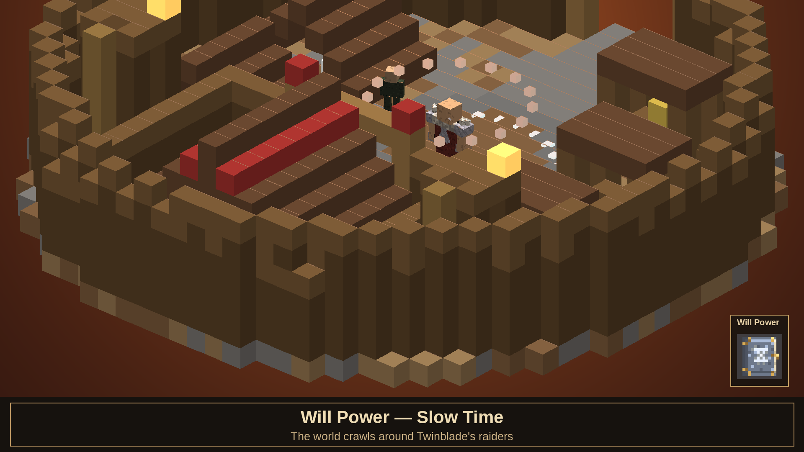

### Boss Encounters

Twinblade anchors the bandit-camp quest line as a dedicated boss encounter, backed by raiders, archers, camp loot and a palisaded arena built for the fight. Lychfield's undead appear as three readable variants — Hollow Men, Hollow Soldiers and Hollow Knights — so the threat level is clear before you get close.


Full bestiary renders live in [screenshots/mobs](screenshots/mobs), with a measured appearance report in [screenshots/AUDIT.md](screenshots/AUDIT.md) — every asset is auto-graded on silhouette, palette richness, contrast and brightness.

---

## 👥 NPCs, Quests & Factions

Albion is populated with townsfolk, guild staff, guards, traders, quest-givers and summonable allies — distinct archetypes for guards, villagers, blacksmiths, barkeeps, traders, the Guildmaster, Maze, Theresa, Lady Grey and the Oracle, each with dialogue and reactions tied to morality and faction reputation.

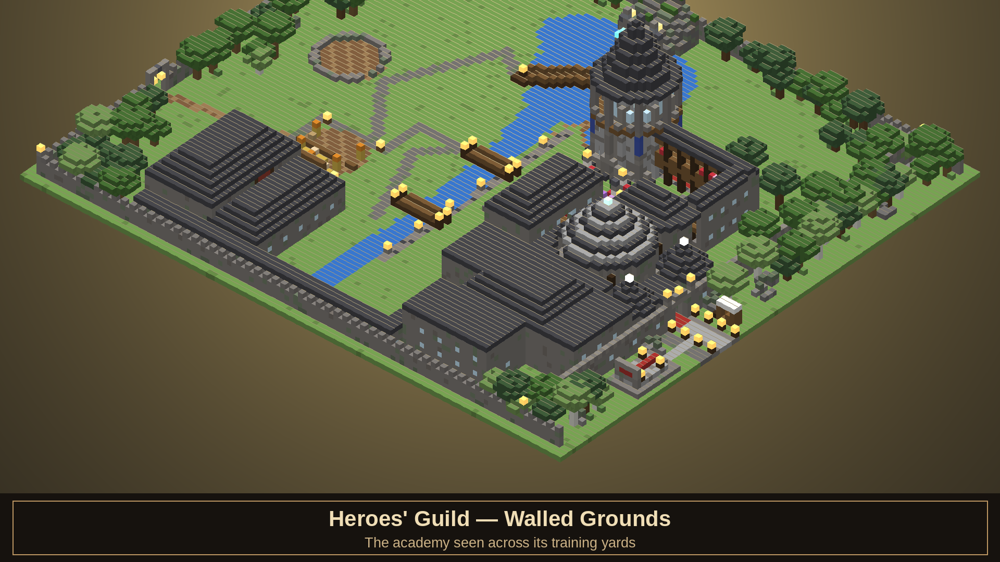

**14 quests** make up the full main chain (Wasp Menace → Twinblade → Jack of Blades) plus side quests, bounty jobs and the Silver Key treasure hunt. A **Quest Table** stands at the heart of the Great Hall's nave — interact with its lectern to browse and accept contracts. A guard's greeting — or threat — depends entirely on where you stand with their faction, and townsfolk will comment on your growing Renown as your fame spreads.

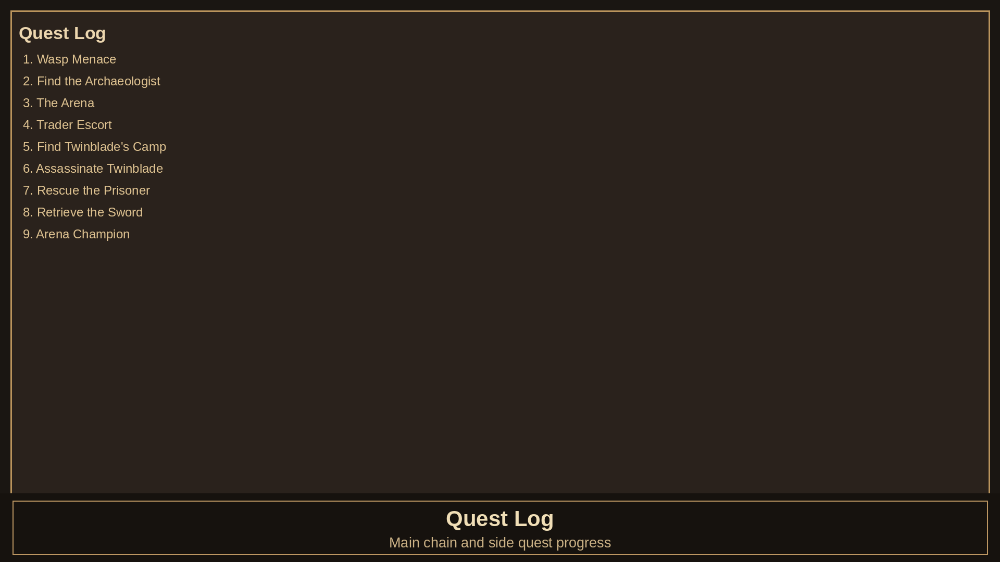
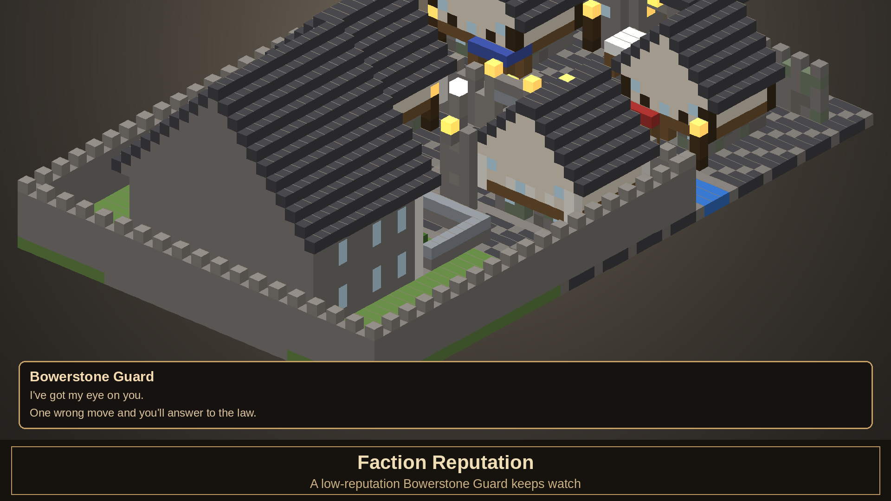


The summoned-ally ecosystem (mercenary, summoned hobbe/wasp/balverine) integrates with Will powers, and Demon Door interactions tie directly into quest, loot, and travel systems.

---

## 🎮 How to Play

| Action | How |
|---|---|
| Open the Hero menu | Use the **Guild Seal** |
| Recall to the Guild | **Sneak + use** the Guild Seal |
| Fast-travel | Stand on a **Cullis Gate** and sneak |
| Take a quest | Use a **Quest Card**, or interact with the **Quest Table** lectern in the Great Hall |
| Cast a Will power | Use its **spell tome** (Maze gifts you two to start) |
| Absorb experience orbs | **Use** a dropped orb — each colour feeds its own discipline |
| Augment a weapon | Use an **augmentation stone** and choose a weapon in the Augmentation Forge |
| Train stats | Hero menu → **Guild Training**, at the Guild's Training Grounds or Map Room |
| Check your standing | Hero menu → **Factions & Standing** |
| Mine Will Shards | Dig for glowing **azurite ore** below y 54 |
| Talk to anyone | Interact with villagers, guards, barkeeps — they remember your reputation |
| Court Lady Grey | Complete her invitation… and bring a ring |

---

## 🛠 Building From Source

Everything regenerates deterministically from the Python pipeline:

```powershell
python -m venv .venv
.venv/Scripts/pip install pillow
.venv/Scripts/python scripts/build_addon.py --full   # regen + validate + package
.venv/Scripts/python scripts/gen_screenshots.py      # re-render the gallery + audit
.venv/Scripts/python scripts/gen_doc_screenshots.py  # build documentation showcase screenshots
```

| Script | Role |
|---|---|
| [scripts/fc_data.py](scripts/fc_data.py) | Single source of truth: items, spells, quests, doors |
| [scripts/fc_mobs.py](scripts/fc_mobs.py) | Mob roster, body-plan geometry, UV packing |
| [scripts/gen_item_textures.py](scripts/gen_item_textures.py) | Paints all 185 item icons + the azurite ore block |
| [scripts/gen_entity_textures.py](scripts/gen_entity_textures.py) | Paints entity skins + worn-armour layer textures |
| [scripts/gen_behavior.py](scripts/gen_behavior.py) | Emits BP items/entities/loot/spawn rules/**122 recipes**/ore features |
| [scripts/gen_resources.py](scripts/gen_resources.py) | Emits RP geometry, client entities, animation controllers, **armour attachables**, lang |
| [scripts/gen_structures.py](scripts/gen_structures.py) | Builds `.mcstructure` NBT for all nine sites |
| [scripts/gen_sounds.py](scripts/gen_sounds.py) | Synthesizes the soundscape from raw math |
| [scripts/gen_screenshots.py](scripts/gen_screenshots.py) | Offline 3D renderer + recipe cards + automated visual audit |
| [scripts/gen_doc_screenshots.py](scripts/gen_doc_screenshots.py) | Composites 3D documentation scenes for README/GitHub showcases |
| [scripts/build_addon.py](scripts/build_addon.py) | Validation + `.mcaddon` packaging |

Gameplay logic lives in [packs/Fablecraft_BP/scripts/main.js](packs/Fablecraft_BP/scripts/main.js) — XP, morality, multiplier, 17 spells, quests, Demon Door dialogue, faction reputation, Cullis Gate travel, structure loot chests, terrain blending, NPC conversations, shops, world decoration and the two-phase Jack of Blades fight.

The generated sound library includes creature voices, NPC speech, item handling, ambience, combat cues and spell/UI sounds; audition the full procedural set in [sound_preview/index.html](sound_preview/index.html).

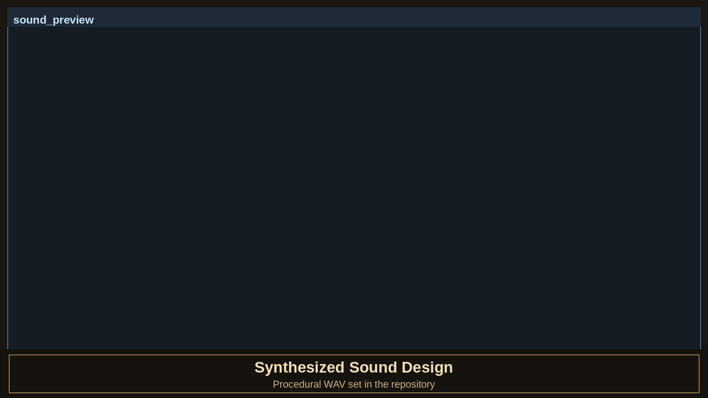

### Status & Media

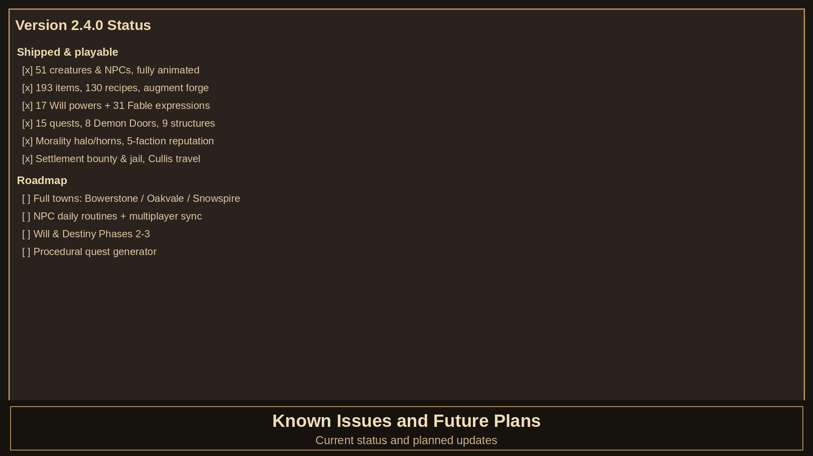


Full generated documentation set and shot manifest: [screenshots/docs/INDEX.md](screenshots/docs/INDEX.md)

---

## ❤️ Support Development

If you are enjoying Fablecraft and want to help keep development moving, please consider supporting the project through Buy Me a Coffee:

[buymeacoffee.com/k8ffh48yvke](https://buymeacoffee.com/k8ffh48yvke)

---

## 📜 Credits & Legal

A fan tribute to *Fable: The Lost Chapters* (Lionhead Studios / Microsoft). All Fable lore, names and concepts belong to Microsoft. Inspired by the original [Fablecraft mod](https://www.planetminecraft.com/mod/fablecraft-mod-216181/) for Minecraft 1.1. Not affiliated with Mojang or Microsoft.

*"Your health is low. Do you have any potions? Or food?"* — you know who
