# ⚔ Fablecraft: Reforged

## ❤️ Support Development

If you are enjoying Fablecraft and want to help keep development moving, please consider supporting the project through Buy Me a Coffee:

[buymeacoffee.com/k8ffh48yvke](https://buymeacoffee.com/k8ffh48yvke)

Development costs have started to rise, and I want to keep improving this project to give players the experience I always dreamed of when I first started it almost fifteen years ago. Any contribution is deeply appreciated and goes directly toward funding the tools needed to continue active development of this mod project.

---

**Transform Minecraft Bedrock into Albion.** A complete recreation of *Fable: The Lost Chapters* as a single `.mcaddon` — Hero XP paths with coloured experience orbs, a living morality system, faction reputation, Will powers, Cullis Gate fast travel, a full mining-and-smithing economy, Demon Doors that talk back, legendary weapons, visible armour, quest chains, Twinblade's war-camps, and Jack of Blades waiting at the end of it all.

> Every texture, model, structure, sound and screenshot in this repository is **procedurally generated from code** — Python paints the pixels, builds the geometry, synthesizes the audio and renders the showcase gallery you see below.


---

## 📸 Documentation Showcase

These generated screenshots are tuned for GitHub's README width: large subjects, minimal dead space, and no tiny placeholder dots masquerading as a showcase.

| World & Encounters | Systems & Progression |
|---|---|
| 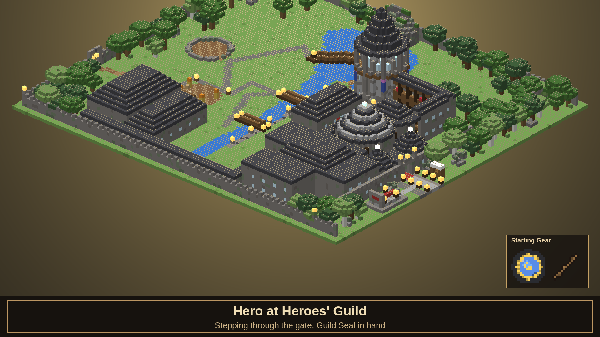 | 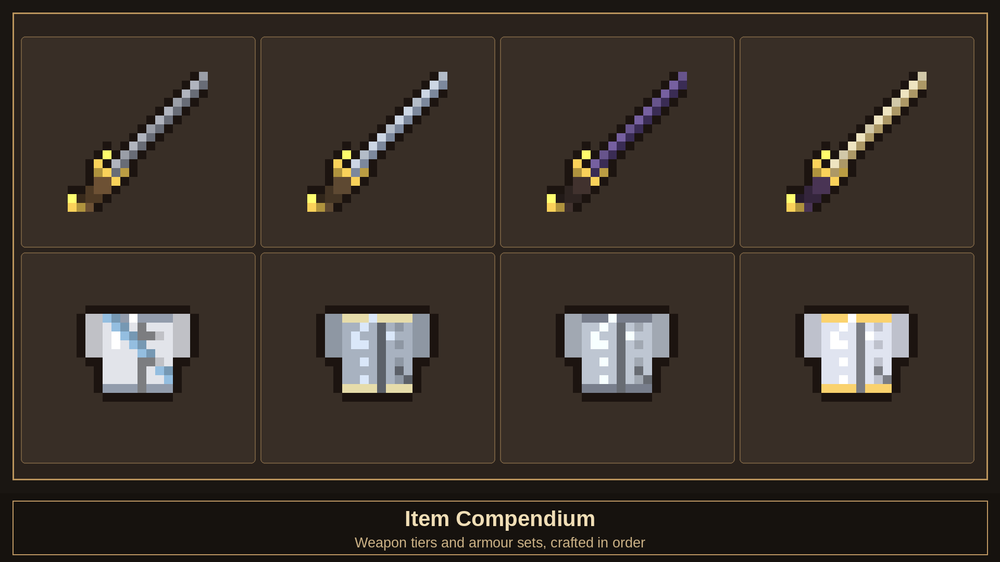 |
| 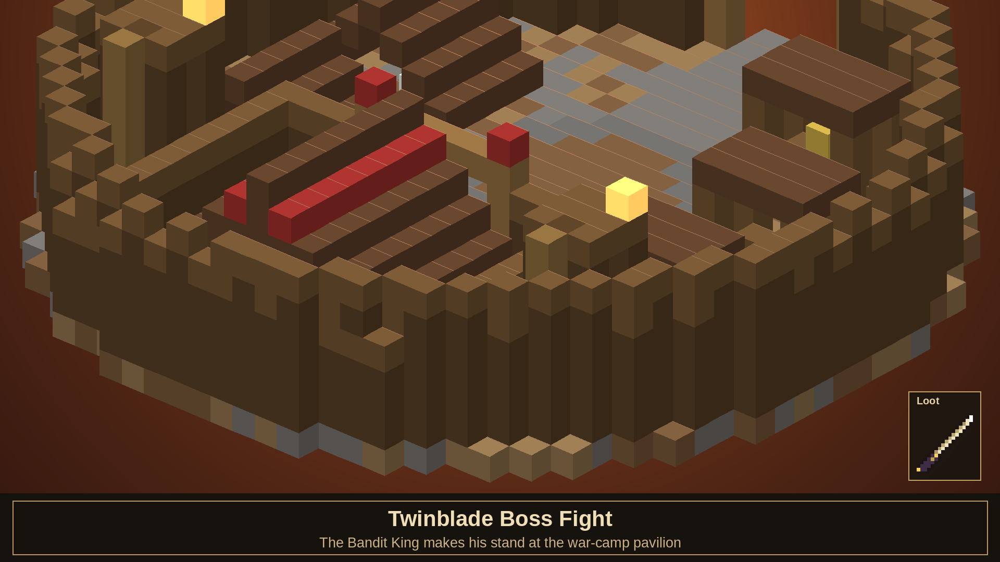 | 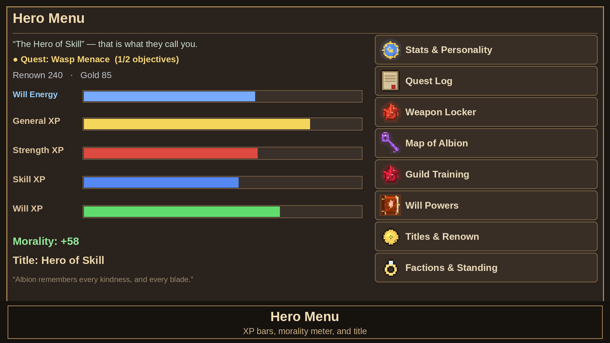 |
| 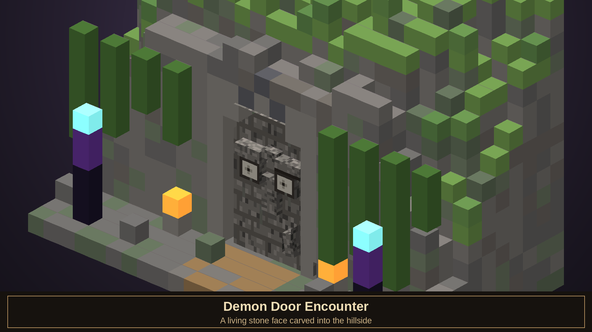 | 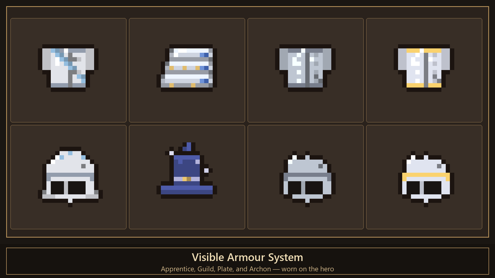 |
| 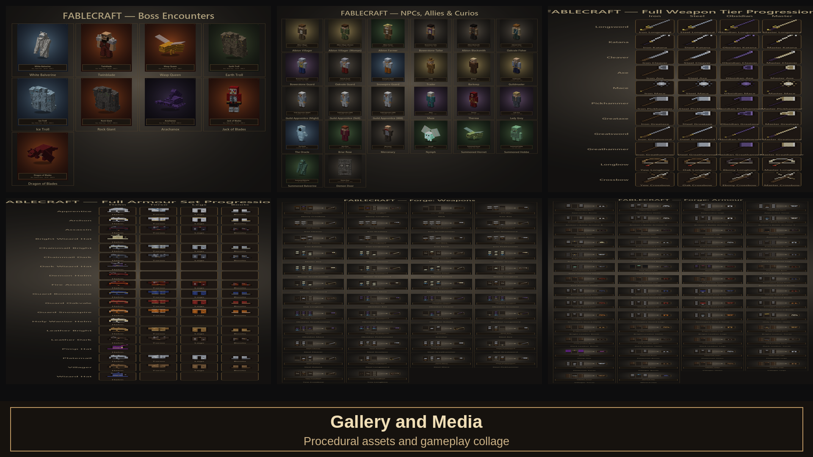 | 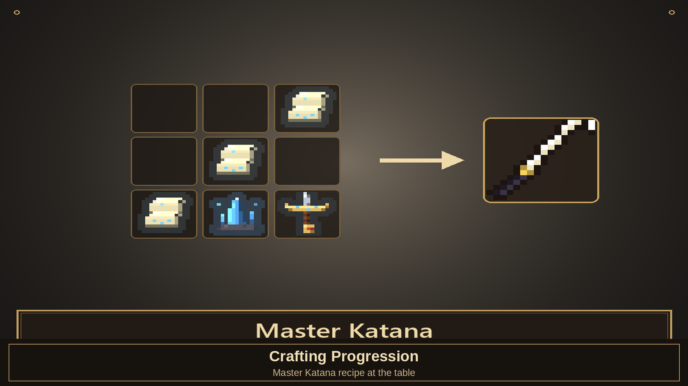 |

Full generated set and shot manifest: [screenshots/docs/INDEX.md](screenshots/docs/INDEX.md)

---

## 📥 Installing

1. Grab **`dist/Fablecraft_Reforged.mcaddon`**.
2. Double-click it (or open it with Minecraft). Both packs import automatically.
3. Create a new world → **Add** the Behavior Pack *Fablecraft: Reforged [Behavior]* (the Resource Pack joins automatically as a dependency).
4. Under world settings, ensure **Holiday Creator Features / Beta APIs** toggles required by your Minecraft version are enabled for scripting.
5. Spawn in. You wake **inside the Heroes' Guild** with the apprentice outfit and a Stick — the Guildmaster is expecting you.

> Prefer separate packs? `dist/Fablecraft_BP.mcpack` and `dist/Fablecraft_RP.mcpack` install individually.

### Requirements
- Minecraft Bedrock **1.21.90+** (Windows / mobile / console via realm host)
- Script API enabled (`@minecraft/server` 1.19, `@minecraft/server-ui` 1.3)

---

## 🗺 What's Inside

| | |
|---|---|
| **45 creatures** | Balverines (standard/White/Frost), Trolls (Earth/Ice/Rock Giant), Hobbes, Bandits and **Twinblade the Bandit King**, Hollow Men in three states of decay (shambler, soldier, knight), Wasps & Wasp Queen, Wraiths, Banshees, Summoners, Minions, Arachanox, Assassins, Nymphs, summoned allies — plus a full NPC cast with helmeted town guards and villager men, women and farmers |
| **185 items** | 58 weapons across Iron→Steel→Obsidian→Master tiers, 14 legendaries, 58 armour pieces in 13 sets (all **visible when worn**), 9 augmentations, smithing ingots, Will Shards, four colours of experience orb, potions, trophies, keys and relics |
| **122 crafting recipes** | Every outfit, weapon and tool is craftable — fold steel from iron and coal, smelt obsidian ingots from obsidian, quench Master ingots in Will Shards mined from **azurite ore** |
| **17 Will powers** | Fireball, Enflame, Lightning, Slow Time, Assassin Rush, Summon, Berserk, Divine Fury, Infernal Wrath and more — each with 4 upgrade levels |
| **14 quests** | The full main chain (Wasp Menace → Twinblade → Jack of Blades) plus side quests, bounty jobs and the Silver Key treasure hunt |
| **8 Demon Doors** | Each with its own personality, demands and hoard — pies, gold, combat multipliers, moonlight, riddles, fame, purity or wickedness — carved into living hillsides so they rise naturally from the land |
| **9 structures** | The walled Heroes' Guild (Cullis Gate + training grounds), the Arena, Temple of Avo, Chapel of Skorm, Twinblade's palisaded war-camp, Lychfield graveyard, focus sites, silver-chest ruins, Demon Door crags — all stocked with **lootable chests** and blended into the terrain |
| **5 factions** | The Guild, Bowerstone, Oakvale, Snowspire and Twinblade's Bandits all track your reputation — prices change, dialogue changes, and guards turn on the infamous |
| **7 synthesized sounds** | Door rumbles and speech, banshee shriek, spell shimmer, level-up chime, guild ambience, sword clash — audition them in [sound_preview/index.html](sound_preview/index.html) |


---

## 🧙 The Hero Systems

### Experience & Training
Kills grant **General XP** plus **Strength** (melee) or **Skill** (ranged) XP; casting grants **Will XP**. Your **Combat Multiplier** climbs with every unanswered hit and multiplies XP gains — take damage and it shatters, exactly as the Guild taught you. Slain foes also shed **experience orbs** in Fable's colours — green (General), red (Strength), yellow (Skill) and blue (Will) — crush them to absorb bonus experience. Bosses burst with them.

Training happens **at the Guild**, the way it should: the **Training Grounds** fill the east yard (archery range, sparring ring, Will circle) and the Map Room holds the Guildmaster. Spend XP on **Physique, Health, Toughness, Speed, Guile, Accuracy** and **Magic Power**.

### The Cullis Gate
The west yard of the Guild holds a humming **Cullis Gate** — Fable's teleport network. Step onto the ring and **sneak** to open the travel menu. Every **Focus Site** you discover in the wild joins the lattice, letting you blink across Albion.

### Morality (-1000 … +1000)
Slay monsters, escort traders and spare the innocent to shine; murder villagers, drain life and eat **Crunchy Chicks** to rot. Your alignment gates spells (Divine Fury vs. Infernal Wrath), changes NPC dialogue, alters Demon Door verdicts, and wreaths you in golden light or black smoke. Titles run from **Paragon** to **Avatar of Skorm**.

### Factions & Reputation
Five factions keep a ledger on you: **the Guild, Bowerstone, Oakvale, Snowspire** and **Twinblade's Bandits**. Clearing bandit camps raises your standing with the towns; cutting down guards or villagers wrecks it. Reputation changes what NPCs say, bends shop prices by up to 20% either way — and if a town marks you **hostile**, its guards attack on sight. Check your standing in the Hero menu under **Factions**.

### Renown
Fame buys better quests, villager adoration… and night-time assassin ambushes. Nothing in Albion is free.

### The Final Choice
Defeat Jack of Blades and his dragon form, and the **Sword of Aeons** is yours. Keep it and rule through fear — or cast it away and receive **Avo's Tear**. The classic ending, your call.


---

## ⛏ Mining & Smithing

Everything you can wear or swing is **craftable**, with a smithing chain that makes Albion-sense:

| Material | How to get it |
|---|---|
| **Iron** | Vanilla iron — the apprentice's metal |
| **Steel Ingot** | Fold 2 iron ingots over coal at a crafting table |
| **Obsidian Ingot** | Smelt a block of obsidian in any furnace — volcanic glass drawn molten |
| **Will Shard** | Mine glowing **azurite ore**, seeded through the deep underground (y 4–54) |
| **Master Ingot** | Quench a steel ingot in two Will Shards — steel remembers the magic |

Weapons follow classic patterns (longswords, katanas, cleavers, axes, maces, pickhammers, greatweapons), bows are bound from planks, string and a tier ingot, and all 13 armour sets craft from themed materials — chainmail from chains, guard uniforms from steel and town-colour wool, the Archon's set from Master ingots and gold. **Augmentations** are forged by binding monster trophies to Will Shards: a Balverine fang and silver-bright iron make a Silver augmentation; a Troll heart makes Health; a Banshee's tear crackles into Lightning.

### Forge Overview


### Smithing Chain, Weapons, and Armour Progression

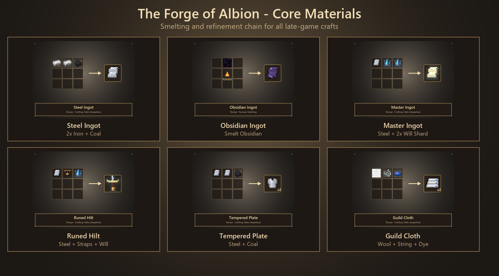
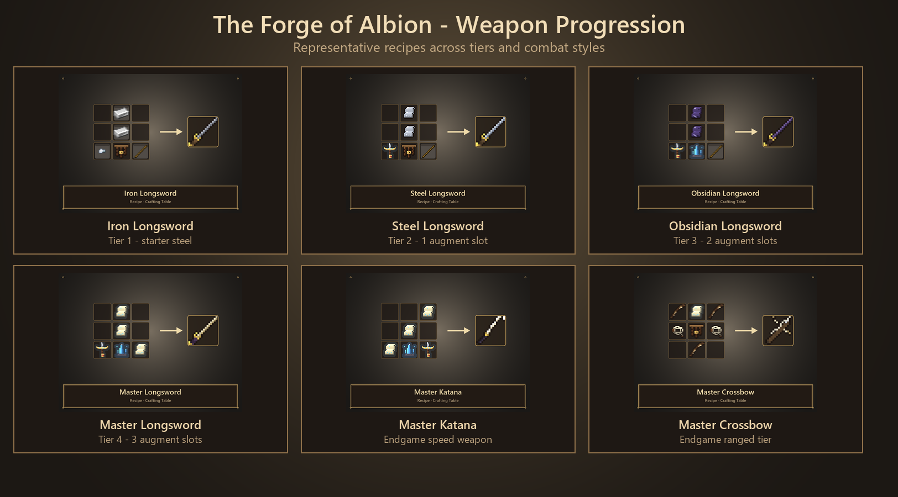
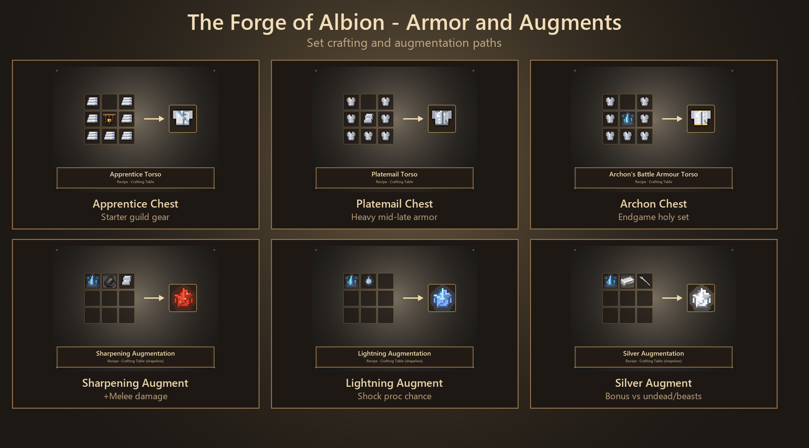

### Complete Crafted Tier Progression (All Lines)

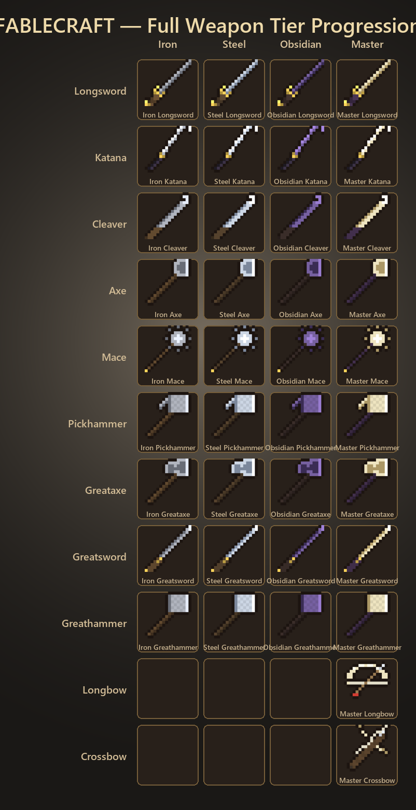
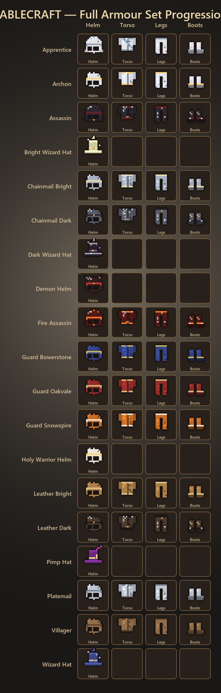

### Recipe Category Galleries

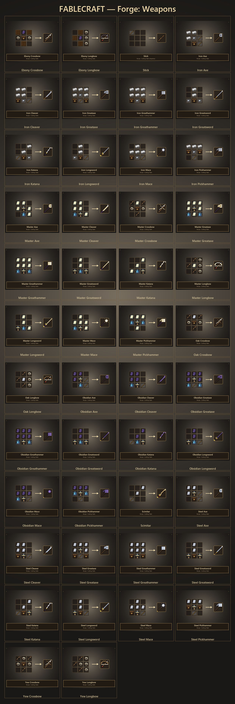
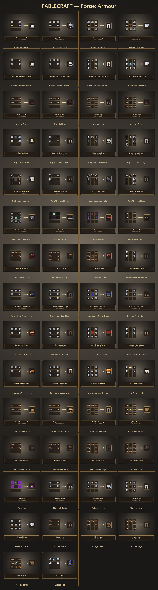
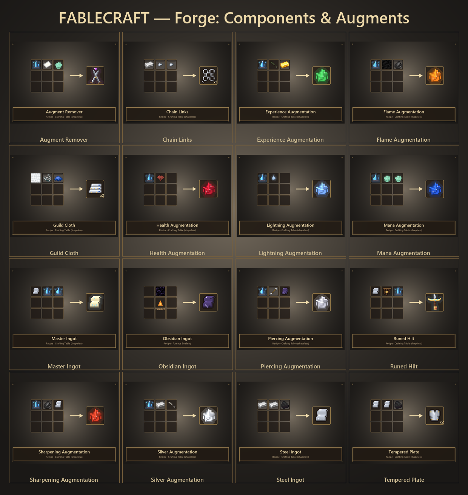

All 130 recipe diagrams live in [screenshots/recipes](screenshots/recipes).

---

## ⚔ Legendary Arsenal

Sword of Aeons · Avo's Tear · The Harbinger · Solus Greatsword · The Bereaver · Avenger · Katana Hiryu · Orkon's Club · Dollmaster's Mace · Wellow's Pickhammer · Arken's Crossbow · Skorm's Bow · Scimitar · and the humble **Stick**.

Weapons carry **augment slots** (Steel 1 / Obsidian 2 / Master 3). Bind **Sharpening, Piercing, Health, Mana, Experience, Lightning, Flame** or **Silver** augmentations — silver burns Balverines and the undead, exactly as the bestiaries warn.


---

## 🚪 Demon Doors

Eight ancient doors are scattered across the world, each a living stone face carved into a **hillside crag** that rises out of the landscape — the placement engine even hunts for naturally sloping ground so every door looks like it has been there for a thousand years. Speak to them. Flatter them. Feed them. One wants five apple pies. One wants to see a Combat Multiplier of 14 mid-battle. One asks a riddle and laughs at you for a century if you miss it. Behind each: legendary weapons, silver keys, elixirs.

| | | |
|---|---|---|
|  |  | 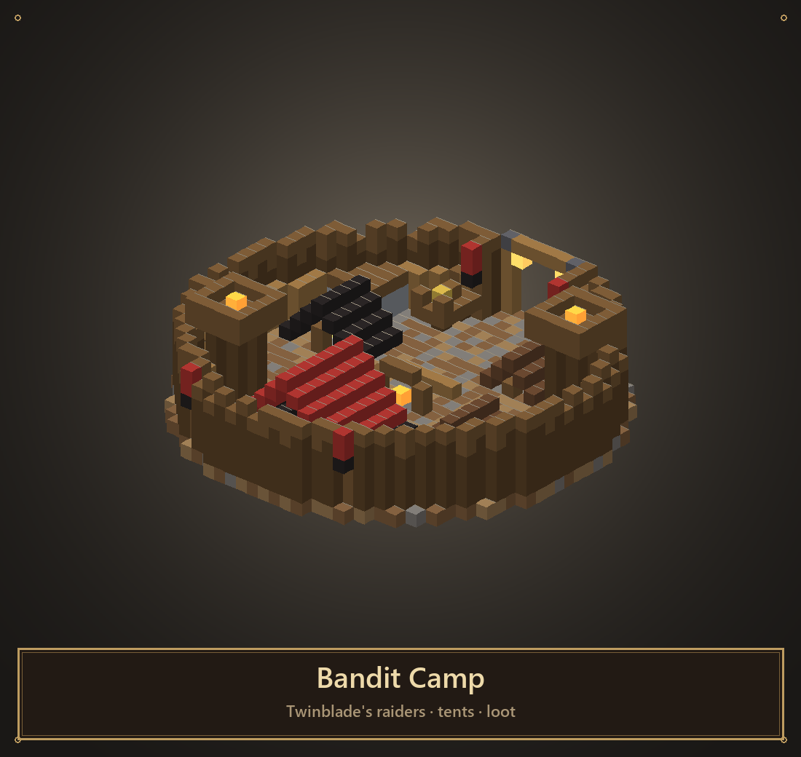 |

---

## 👹 Rogues' Gallery

### Boss Encounters

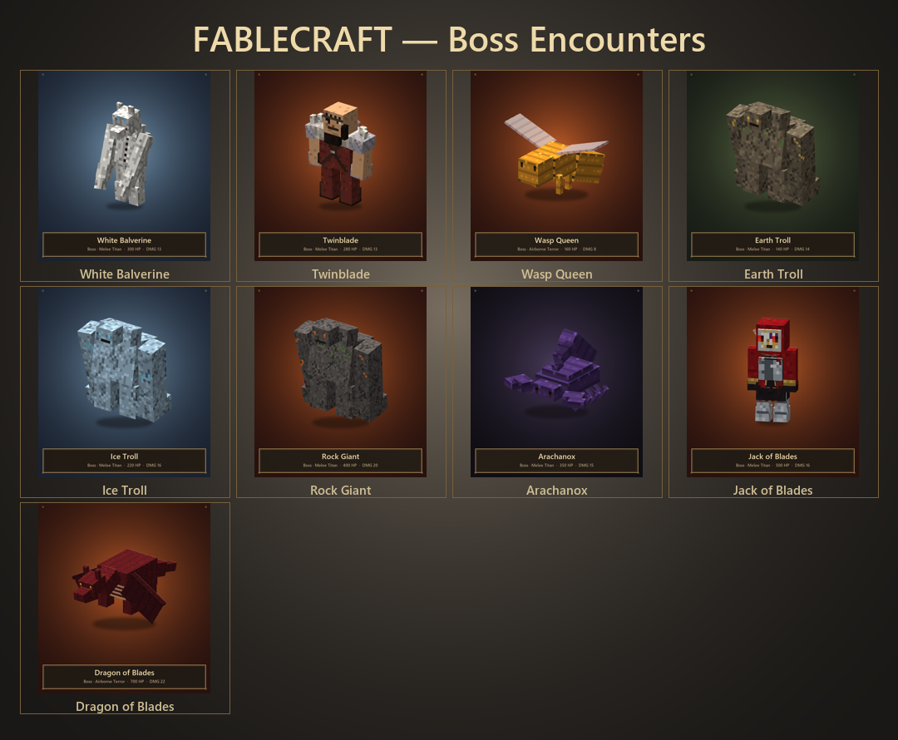
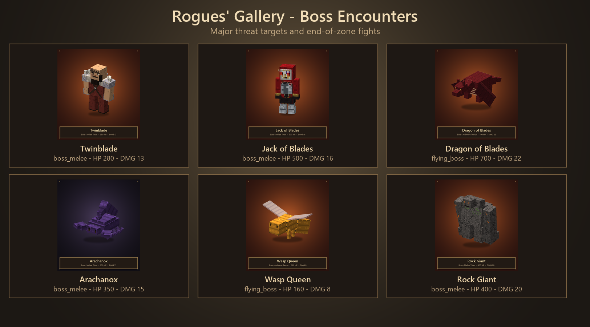

### Hostile Factions and Creature Families

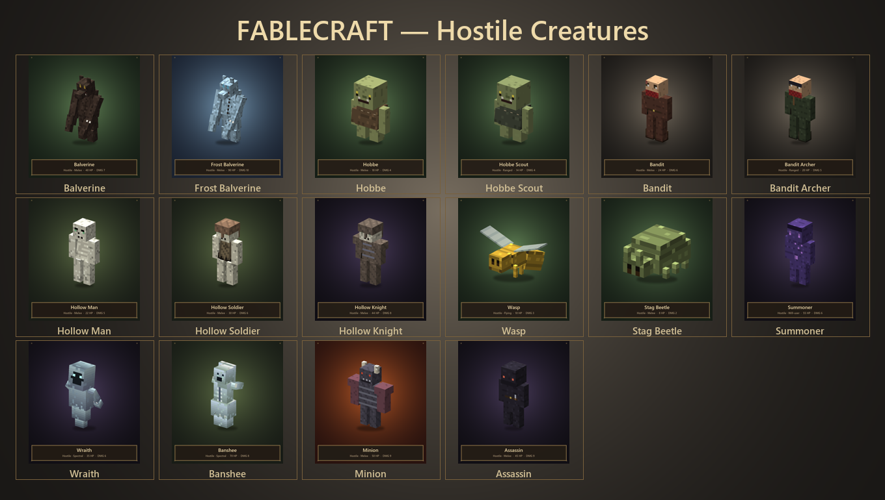
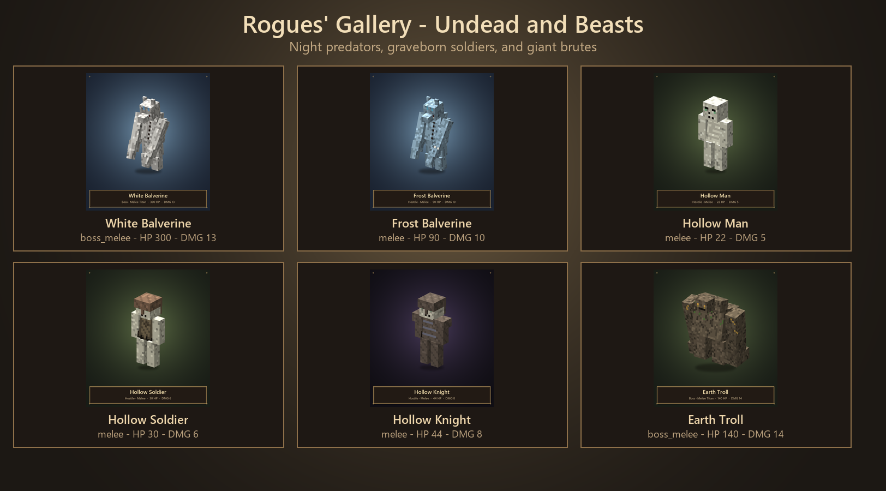
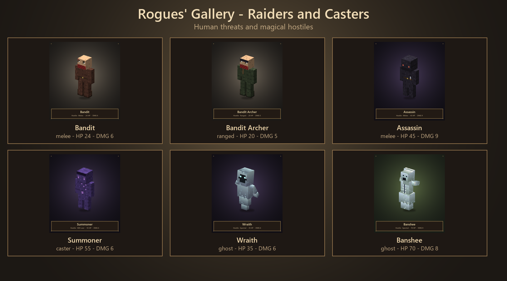

Twinblade anchors the bandit-camp quest line as a dedicated boss encounter, backed by raiders, archers, camp loot and a palisaded arena built for the fight. Lychfield's undead appear as three readable variants — Hollow Men, Hollow Soldiers and Hollow Knights — so the threat level is clear before you get close.

Full bestiary renders live in [screenshots/mobs](screenshots/mobs), with a measured appearance report in [screenshots/AUDIT.md](screenshots/AUDIT.md) — every asset is auto-graded on silhouette, palette richness, contrast and brightness.

---

## 👥 NPCs, Allies, and Interesting Systems

Fablecraft is not only a bestiary and loot overhaul. Albion is populated with townsfolk, guild staff, guards, traders, quest-givers, summonable allies, and reactive faction logic.

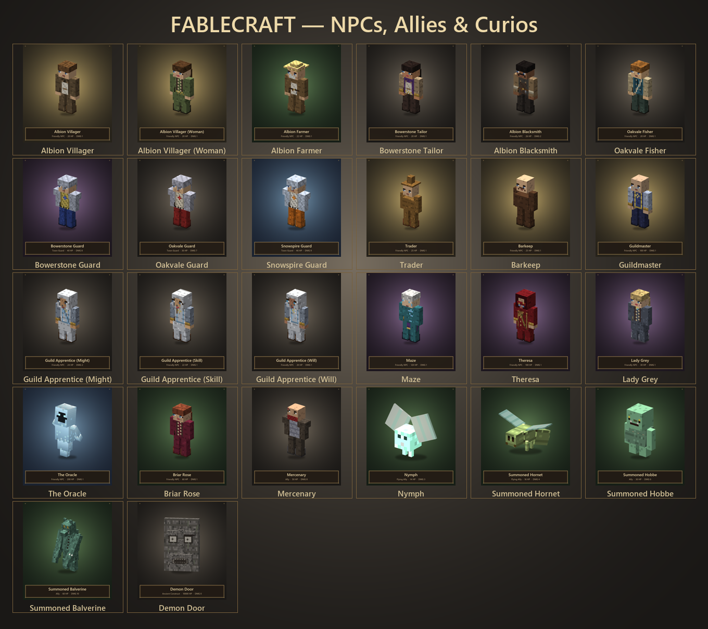

Highlights:

- Distinct NPC archetypes: guards, villagers, blacksmiths, barkeeps, traders, Guildmaster, Maze, Theresa, Lady Grey, and Oracle.
- Dialogue and reactions tied to morality and faction reputation.
- Summoned ally ecosystem (mercenary, summoned hobbe/wasp/balverine) integrated with Will powers.
- Demon Door interactions and world structures tied directly into quest, loot, and travel systems.
- Hero systems (XP paths, morality title shifts, Cullis attunement) reflected in both UI and world behavior.

---

## 🎮 How to Play

| Action | How |
|---|---|
| Open the Hero menu | Use the **Guild Seal** |
| Recall to the Guild | **Sneak + use** the Guild Seal |
| Fast-travel | Stand on a **Cullis Gate** and sneak |
| Take a quest | Use a **Quest Card** (the Guildmaster hands them out) |
| Cast a Will power | Use its **spell tome** (Maze gifts you two to start) |
| Absorb experience orbs | **Use** a dropped orb — each colour feeds its own discipline |
| Augment a weapon | Use an **augmentation stone** with the weapon in your hotbar |
| Train stats | Hero menu → **Guild Training**, at the Guild's Training Grounds or Map Room |
| Check your standing | Hero menu → **Factions & Standing** |
| Mine Will Shards | Dig for glowing **azurite ore** below y 54 |
| Talk to anyone | Interact with villagers, guards, barkeeps — they remember your reputation |
| Court Lady Grey | Complete her invitation… and bring a ring |

You wake **inside the Heroes' Guild** wearing the apprentice outfit with a trusty Stick — every legend starts somewhere. Worn armour is **visible on your character**, from apprentice hood to Archon plate.

---

## 🛠 Building From Source

Everything regenerates deterministically from the Python pipeline:

```powershell
python -m venv .venv
.venv/Scripts/pip install pillow
.venv/Scripts/python scripts/build_addon.py --full   # regen + validate + package
.venv/Scripts/python scripts/gen_screenshots.py      # re-render the gallery + audit
.venv/Scripts/python scripts/gen_doc_screenshots.py  # build documentation showcase screenshots
```

| Script | Role |
|---|---|
| [scripts/fc_data.py](scripts/fc_data.py) | Single source of truth: items, spells, quests, doors |
| [scripts/fc_mobs.py](scripts/fc_mobs.py) | Mob roster, body-plan geometry, UV packing |
| [scripts/gen_item_textures.py](scripts/gen_item_textures.py) | Paints all 185 item icons + the azurite ore block |
| [scripts/gen_entity_textures.py](scripts/gen_entity_textures.py) | Paints entity skins + worn-armour layer textures |
| [scripts/gen_behavior.py](scripts/gen_behavior.py) | Emits BP items/entities/loot/spawn rules/**122 recipes**/ore features |
| [scripts/gen_resources.py](scripts/gen_resources.py) | Emits RP geometry, client entities, animation controllers, **armour attachables**, lang |
| [scripts/gen_structures.py](scripts/gen_structures.py) | Builds `.mcstructure` NBT for all nine sites |
| [scripts/gen_sounds.py](scripts/gen_sounds.py) | Synthesizes the soundscape from raw math |
| [scripts/gen_screenshots.py](scripts/gen_screenshots.py) | Offline 3D renderer + recipe cards + automated visual audit |
| [scripts/gen_doc_screenshots.py](scripts/gen_doc_screenshots.py) | Documentation scene screenshot compositor for README/GitHub showcases |
| [scripts/build_addon.py](scripts/build_addon.py) | Validation + `.mcaddon` packaging |

Gameplay logic lives in [packs/Fablecraft_BP/scripts/main.js](packs/Fablecraft_BP/scripts/main.js) — XP, morality, multiplier, 17 spells, quests, Demon Door dialogue, faction reputation, Cullis Gate travel, structure loot chests, terrain blending, NPC conversations, shops, world decoration and the two-phase Jack of Blades fight.

---

## 📜 Credits & Legal

A fan tribute to *Fable: The Lost Chapters* (Lionhead Studios / Microsoft). All Fable lore, names and concepts belong to Microsoft. Inspired by the original [Fablecraft mod](https://www.planetminecraft.com/mod/fablecraft-mod-216181/) for Minecraft 1.1. Not affiliated with Mojang or Microsoft.

*"Your health is low. Do you have any potions? Or food?"* — you know who
