# ⚔ Fablecraft: Reforged

**Transform Minecraft Bedrock into Albion.** A complete recreation of *Fable: The Lost Chapters* as a single `.mcaddon` — Hero XP paths, a living morality system, Will powers, Demon Doors that talk back, legendary weapons, quest chains, and Jack of Blades waiting at the end of it all.

> Every texture, model, structure, sound and screenshot in this repository is **procedurally generated from code** — Python paints the pixels, builds the geometry, synthesizes the audio and renders the showcase gallery you see below.

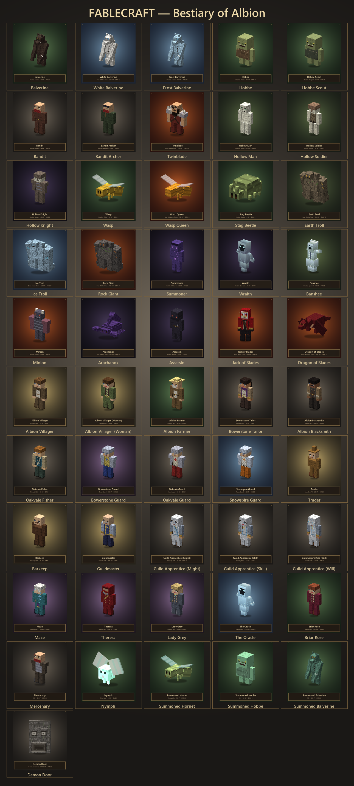

---

## 📥 Installing

1. Grab **`dist/Fablecraft_Reforged.mcaddon`**.
2. Double-click it (or open it with Minecraft). Both packs import automatically.
3. Create a new world → **Add** the Behavior Pack *Fablecraft: Reforged [Behavior]* (the Resource Pack joins automatically as a dependency).
4. Under world settings, ensure **Holiday Creator Features / Beta APIs** toggles required by your Minecraft version are enabled for scripting.
5. Spawn in. The **Heroes' Guild** rises near your spawn point — the Guildmaster is expecting you.

> Prefer separate packs? `dist/Fablecraft_BP.mcpack` and `dist/Fablecraft_RP.mcpack` install individually.

### Requirements
- Minecraft Bedrock **1.21.90+** (Windows / mobile / console via realm host)
- Script API enabled (`@minecraft/server` 1.19, `@minecraft/server-ui` 1.3)

---

## 🗺 What's Inside

| | |
|---|---|
| **40 creatures** | Balverines (standard/White/Frost), Trolls (Earth/Ice/Rock Giant), Hobbes, Bandits, Hollow Men, Wasps & Wasp Queen, Wraiths, Banshees, Summoners, Minions, Arachanox, Assassins, Nymphs, summoned allies — plus a full NPC cast |
| **177 items** | 58 weapons across Iron→Steel→Obsidian→Master tiers, 14 legendaries, 58 armour pieces in 13 sets, 9 augmentations, potions, trophies, keys and relics |
| **17 Will powers** | Fireball, Enflame, Lightning, Slow Time, Assassin Rush, Summon, Berserk, Divine Fury, Infernal Wrath and more — each with 4 upgrade levels |
| **14 quests** | The full main chain (Wasp Menace → Jack of Blades) plus side quests, bounty jobs and the Silver Key treasure hunt |
| **8 Demon Doors** | Each with its own personality, demands and hoard — pies, gold, combat multipliers, moonlight, riddles, fame, purity or wickedness |
| **9 structures** | Heroes' Guild, the Arena, Temple of Avo, Chapel of Skorm, bandit camps, graveyards, focus sites, silver-chest ruins, Demon Door arches |
| **7 synthesized sounds** | Door rumbles and speech, banshee shriek, spell shimmer, level-up chime, guild ambience, sword clash |

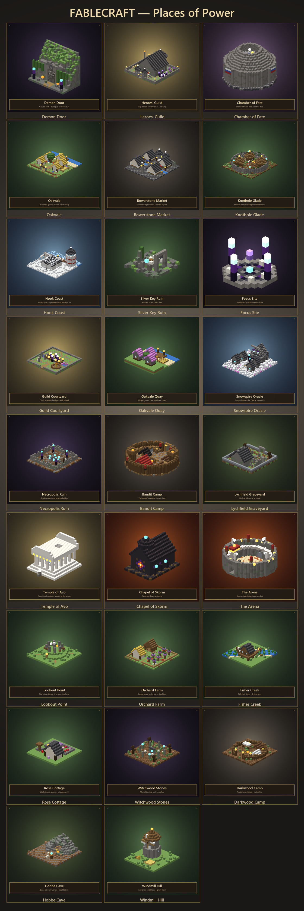

---

## 🧙 The Hero Systems

### Experience & Training
Kills grant **General XP** plus **Strength** (melee) or **Skill** (ranged) XP; casting grants **Will XP**. Your **Combat Multiplier** climbs with every unanswered hit and multiplies XP gains — take damage and it shatters, exactly as the Guild taught you. Spend XP in the Guild Map Room on **Physique, Health, Toughness, Speed, Guile, Accuracy** and **Magic Power**.

### Morality (-1000 … +1000)
Slay monsters, escort traders and spare the innocent to shine; murder villagers, drain life and eat **Crunchy Chicks** to rot. Your alignment gates spells (Divine Fury vs. Infernal Wrath), changes NPC dialogue, alters Demon Door verdicts, and wreaths you in golden light or black smoke. Titles run from **Paragon** to **Avatar of Skorm**.

### Renown
Fame buys better quests, villager adoration… and night-time assassin ambushes. Nothing in Albion is free.

### The Final Choice
Defeat Jack of Blades and his dragon form, and the **Sword of Aeons** is yours. Keep it and rule through fear — or cast it away and receive **Avo's Tear**. The classic ending, your call.

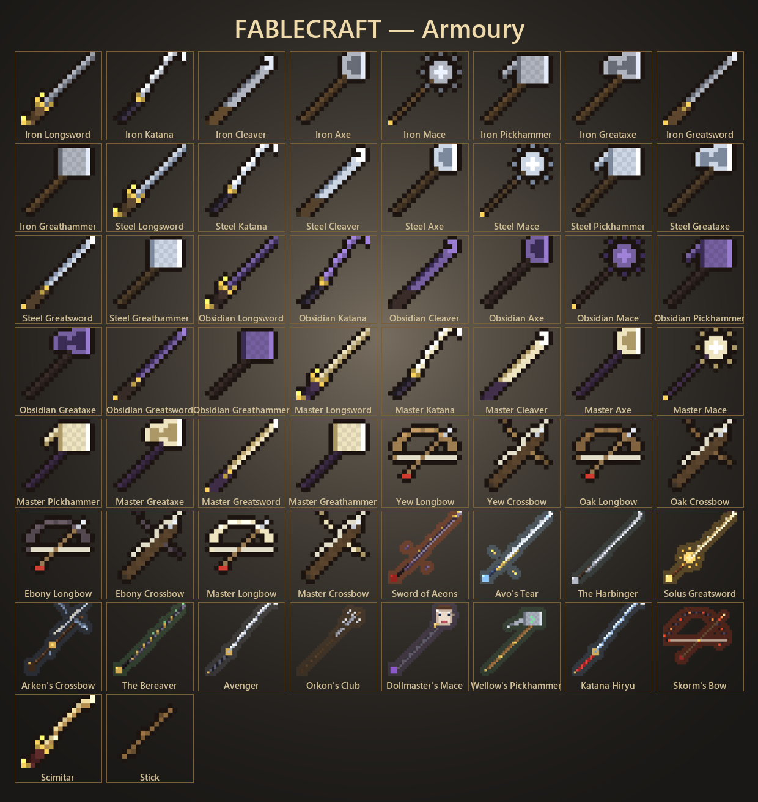

---

## ⚔ Legendary Arsenal

Sword of Aeons · Avo's Tear · The Harbinger · Solus Greatsword · The Bereaver · Avenger · Katana Hiryu · Orkon's Club · Dollmaster's Mace · Wellow's Pickhammer · Arken's Crossbow · Skorm's Bow · Scimitar · and the humble **Stick**.

Weapons carry **augment slots** (Steel 1 / Obsidian 2 / Master 3). Bind **Sharpening, Piercing, Health, Mana, Experience, Lightning, Flame** or **Silver** augmentations — silver burns Balverines and the undead, exactly as the bestiaries warn.

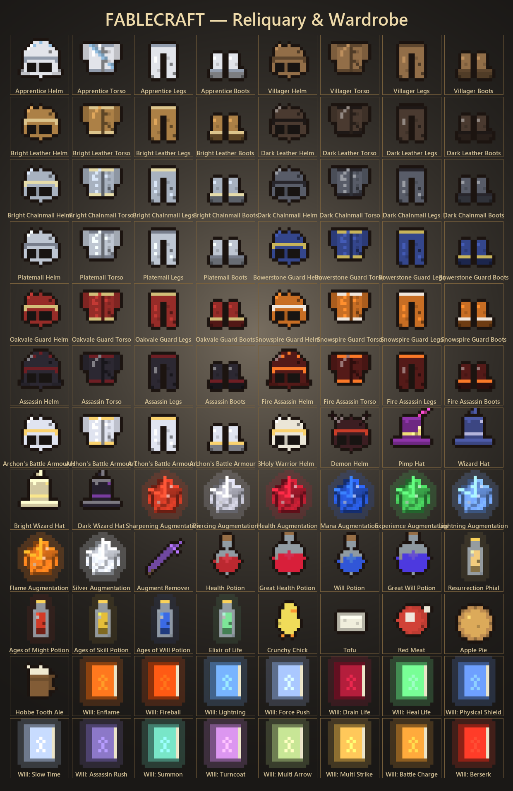

---

## 🚪 Demon Doors

Eight ancient doors are scattered across the world, each a multiblock arch with a carved, animated stone face. Speak to them. Flatter them. Feed them. One wants five apple pies. One wants to see a Combat Multiplier of 14 mid-battle. One asks a riddle and laughs at you for a century if you miss it. Behind each: legendary weapons, silver keys, elixirs.

| | | |
|---|---|---|
| 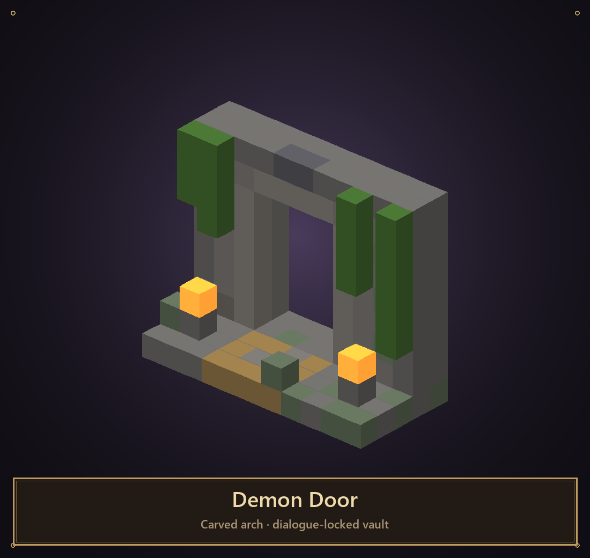 | 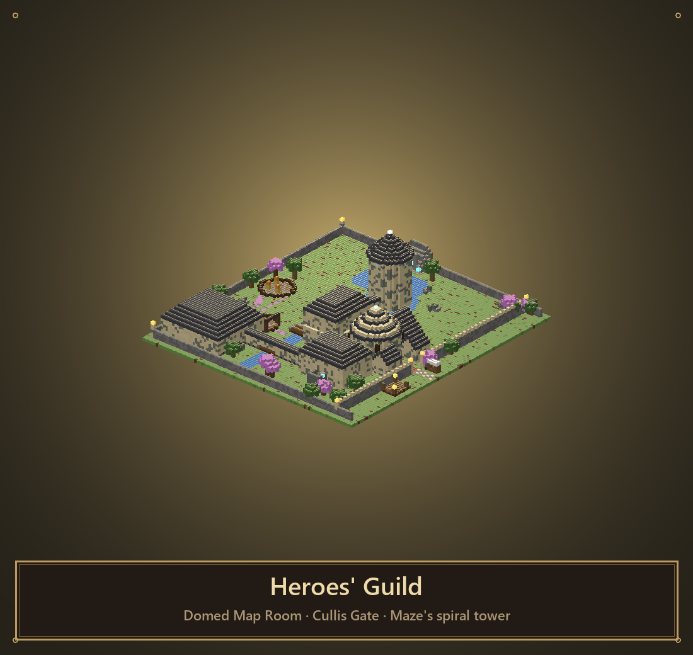 | 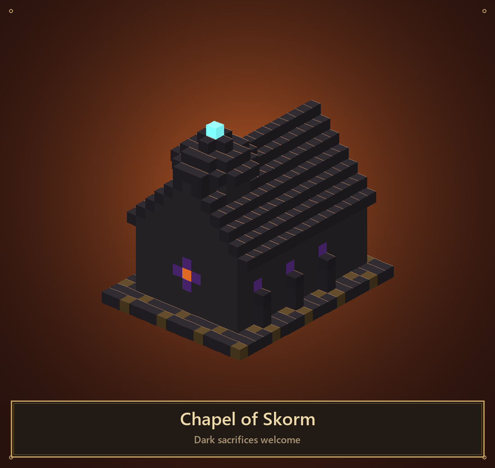 |

---

## 👹 Rogues' Gallery

| | | |
|---|---|---|
| 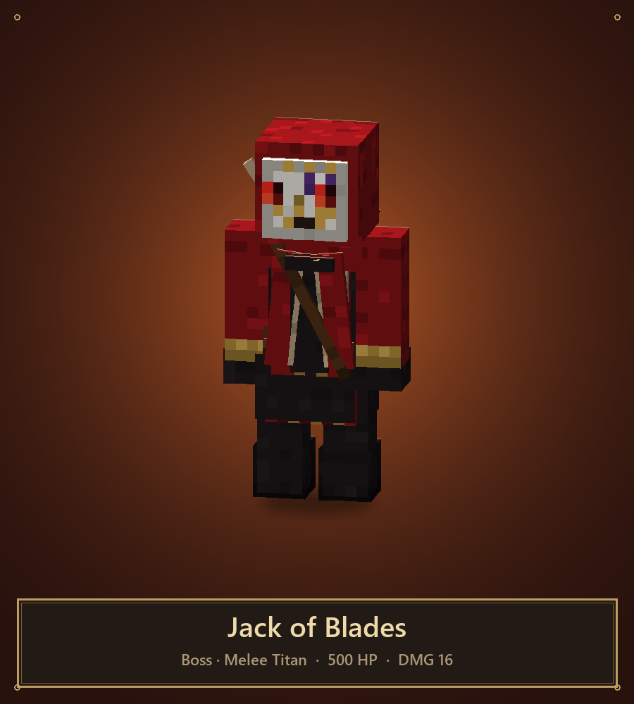 | 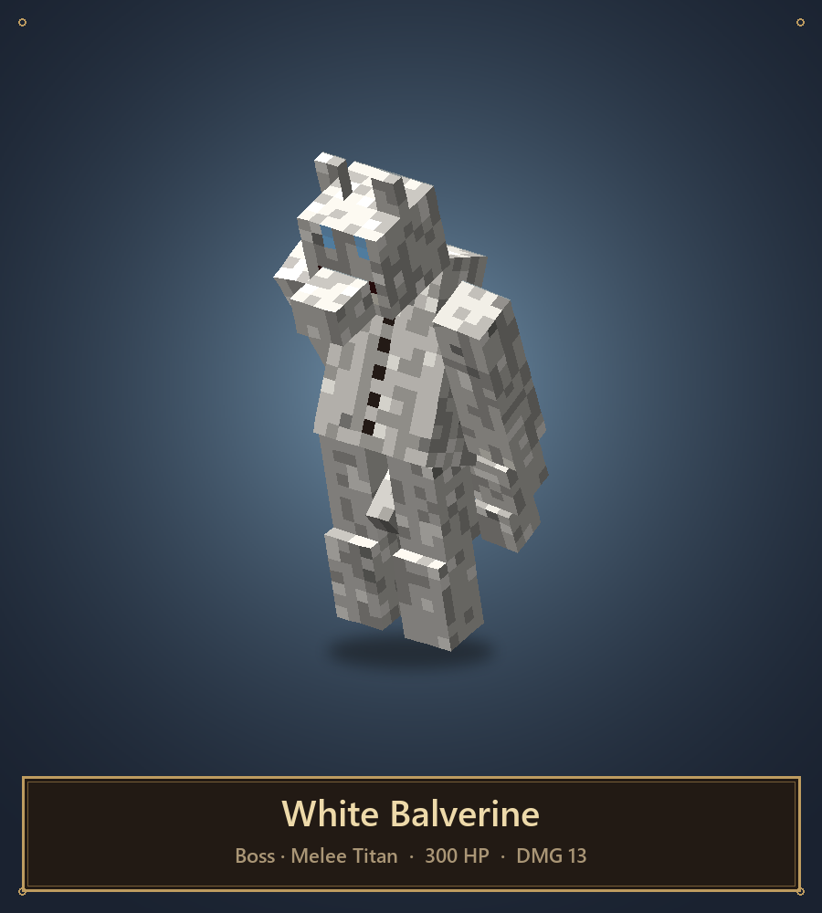 | 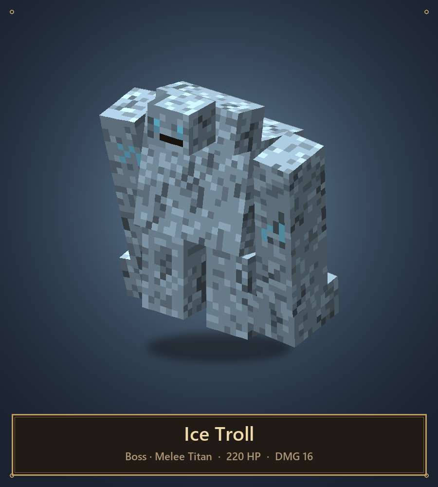 |
| 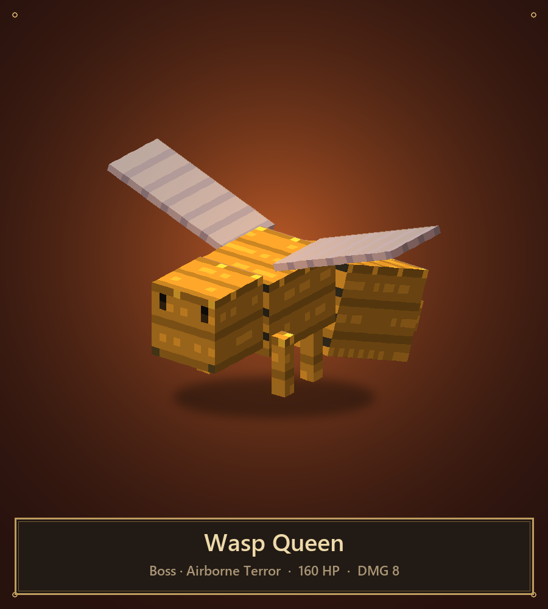 | 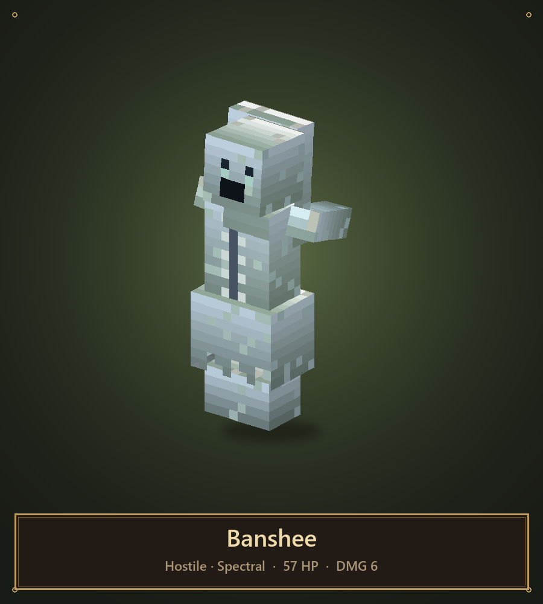 | 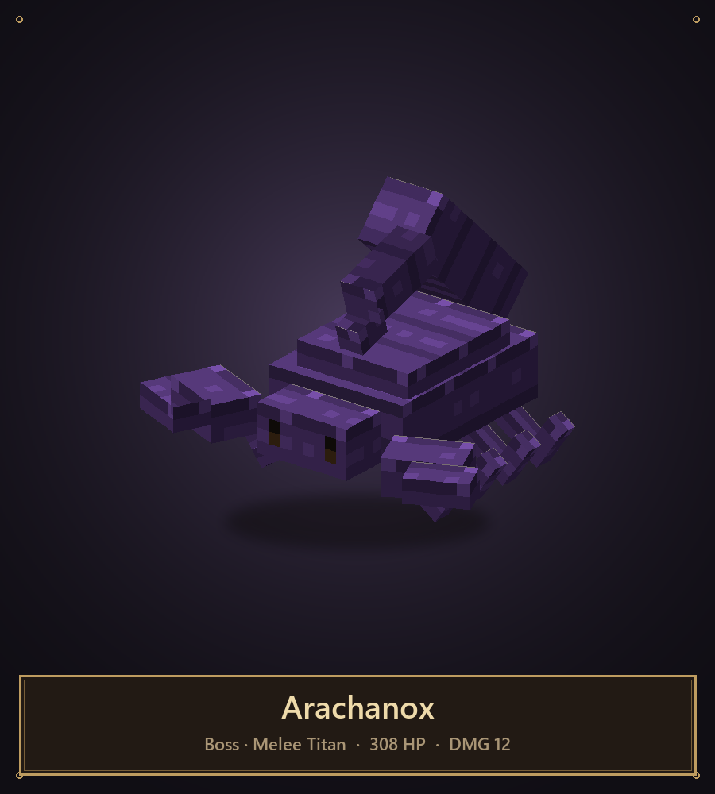 |

Full bestiary renders live in [screenshots/mobs](screenshots/mobs), with a measured appearance report in [screenshots/AUDIT.md](screenshots/AUDIT.md) — every asset is auto-graded on silhouette, palette richness, contrast and brightness.

---

## 🎮 How to Play

| Action | How |
|---|---|
| Open the Hero menu | Use the **Guild Seal** |
| Recall to the Guild | **Sneak + use** the Guild Seal |
| Take a quest | Use a **Quest Card** (the Guildmaster hands them out) |
| Cast a Will power | Use its **spell tome** (Maze gifts you two to start) |
| Augment a weapon | Use an **augmentation stone** with the weapon in your hotbar |
| Train stats | Hero menu → **Guild Training**, while inside the Guild |
| Court Lady Grey | Complete her invitation… and bring a ring |

---

## 🛠 Building From Source

Everything regenerates deterministically from the Python pipeline:

```powershell
python -m venv .venv
.venv/Scripts/pip install pillow
.venv/Scripts/python scripts/build_addon.py --full   # regen + validate + package
.venv/Scripts/python scripts/gen_screenshots.py      # re-render the gallery + audit
```

| Script | Role |
|---|---|
| [scripts/fc_data.py](scripts/fc_data.py) | Single source of truth: items, spells, quests, doors |
| [scripts/fc_mobs.py](scripts/fc_mobs.py) | Mob roster, body-plan geometry, UV packing |
| [scripts/gen_item_textures.py](scripts/gen_item_textures.py) | Paints all 177 item icons |
| [scripts/gen_entity_textures.py](scripts/gen_entity_textures.py) | Paints entity skins onto exact model UVs |
| [scripts/gen_behavior.py](scripts/gen_behavior.py) | Emits BP items/entities/loot/spawn rules + script data |
| [scripts/gen_resources.py](scripts/gen_resources.py) | Emits RP geometry, client entities, animations, lang |
| [scripts/gen_structures.py](scripts/gen_structures.py) | Builds `.mcstructure` NBT for all nine sites |
| [scripts/gen_sounds.py](scripts/gen_sounds.py) | Synthesizes the soundscape from raw math |
| [scripts/gen_screenshots.py](scripts/gen_screenshots.py) | Offline 3D renderer + automated visual audit |
| [scripts/build_addon.py](scripts/build_addon.py) | Validation + `.mcaddon` packaging |

Gameplay logic lives in [packs/Fablecraft_BP/scripts/main.js](packs/Fablecraft_BP/scripts/main.js) — XP, morality, multiplier, 17 spells, quests, Demon Door dialogue, NPC conversations, shops, world decoration and the two-phase Jack of Blades fight.

---

## 📜 Credits & Legal

A fan tribute to *Fable: The Lost Chapters* (Lionhead Studios / Microsoft). All Fable lore, names and concepts belong to Microsoft. Inspired by the original [Fablecraft mod](https://www.planetminecraft.com/mod/fablecraft-mod-216181/) for Minecraft 1.1. Not affiliated with Mojang or Microsoft.

*"Your health is low. Do you have any potions? Or food?"* — you know who
