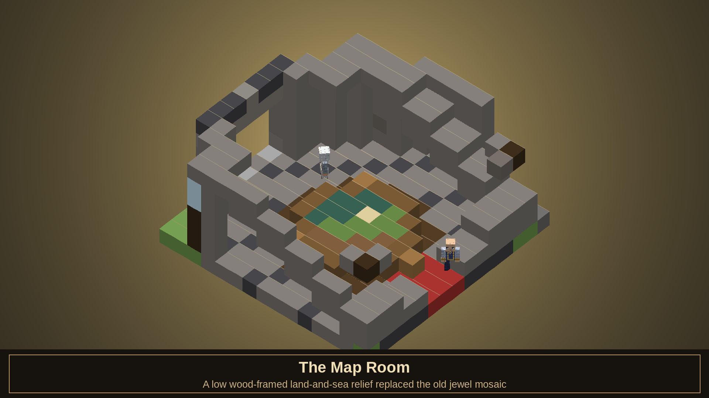
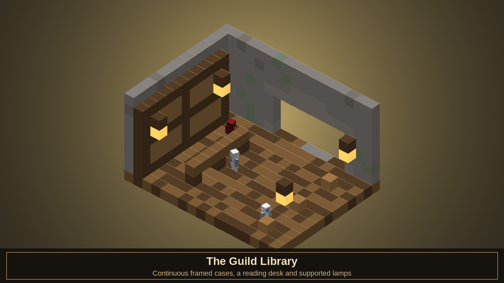
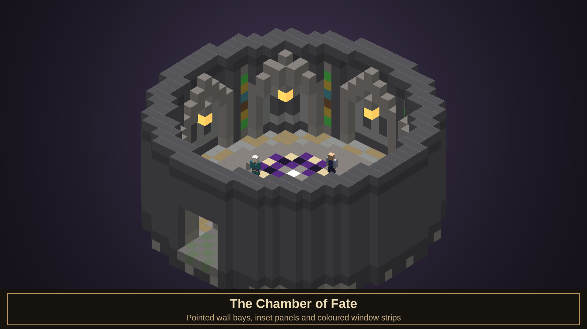
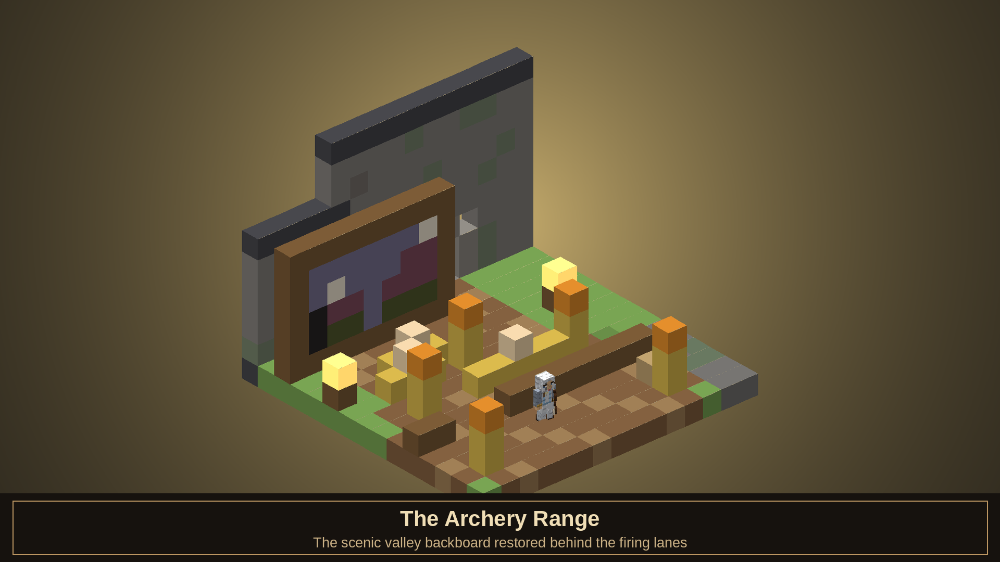
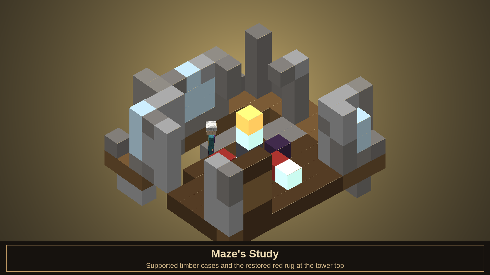
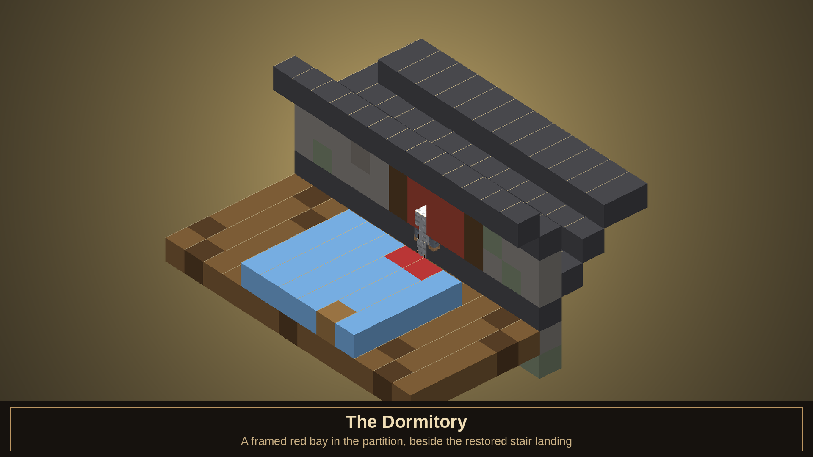
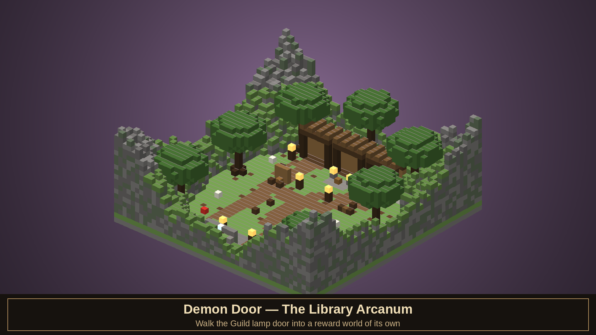
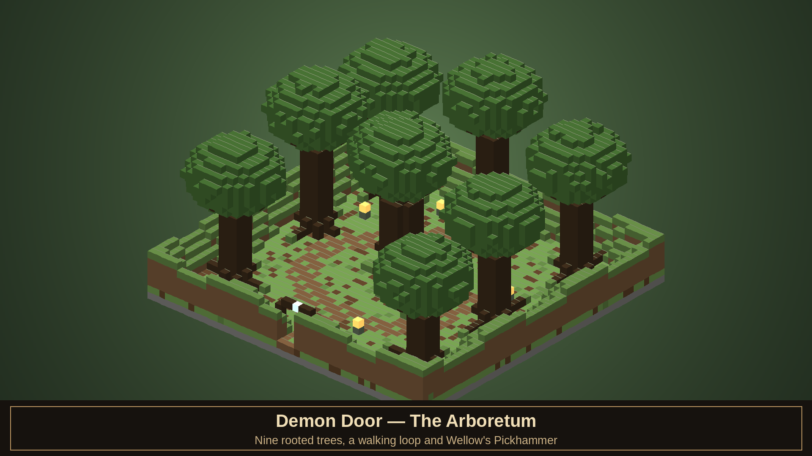

# ⚔ Fablecraft: Reforged

**Transform Minecraft Bedrock into Albion.** An in-progress recreation of *Fable: The Lost Chapters* as a single `.mcaddon` — Hero XP paths with coloured experience orbs, a living morality system, faction reputation, Will powers, Cullis Gate fast travel, a full mining-and-smithing economy, Demon Doors that talk back, legendary weapons, armour sets, quest chains, expressive townsfolk who walk, emote and react to you, Twinblade's war-camps, and Jack of Blades waiting at the end of it all.

> Every texture, model, structure and sound in this repository is **procedurally generated from code** — Python paints the pixels, builds the geometry, synthesizes the audio and renders the 3D showcase scenes below. The captures tagged *in-game* are the real thing, running live in Minecraft Bedrock.


| | | | | | | | | | |
|---|---|---|---|---|---|---|---|---|---|
| **51** creatures & NPCs | **195** item files | **131** recipes | **18** Will powers | **15** quests | **31** emotes | **8** Demon Doors | **29** structure files | **5** factions | **262** sounds |

Counts verified 2026-09-12: 51 roster definitions plus player/overlay assets produce 55 BP entity files; 194 data items plus Will Focus produce 195 item files. The 29 structure files include 23 scatter entries and fixed/legacy structures. Sound definitions remain 262 (535 WAV variations).

> **Current development version: v2.4.0** — built for Minecraft Bedrock **1.21.100+**.

---

## ✨ What's New in 2.4.0

- **The Lost Chapters-style interface.** The Guild Seal now opens a nine-section storybook menu matching the original PC structure: **Items, Weapons, Magic, Clothing, Expressions, Quests, Stats, Logbook, and Map**. Dark leather panels, warm parchment controls, gilt trim, and a dedicated Will Focus icon carry the original game's illuminated-manuscript direction into Bedrock.
- **Every major system has a UI path.** Equip weapons and full clothing suits, use inventory provisions and experience orbs, perform all learned expressions, inspect active and completed quests, manage legacy Will tomes and the modular Will Focus, review factions and bounties, train, choose titles, and travel through the Cullis lattice without command-only gaps.
- **Expanded trading and crime feedback.** Shops now support buy-one, buy-maximum, sell-one, sell-maximum, and exact quantity selection. Active warrants display an on-screen crime meter with the settlement, fine, response tier, and expiry time.
- **Faithful TLC navigation.** The Map remains a Cullis destination list with Guild recall; it intentionally does not add Fable II's golden breadcrumb trail.
- **Living NPCs — full body animation.** Every villager, guard, Guild member and named character now walks with alternating limbs and a weight-shifted bob, breathes on idle, looks around, gestures while talking and follows through on attacks — no more sliding statues. Identical townsfolk are phase-offset so a crowd never moves in lockstep.
- **31 Fable expressions & emotes.** The full *Fable: The Lost Chapters* expression set — Flirt, Blood Lust Roar, Belch, Laugh, Clap, Apologise, Dance and more — drives both your hero and the NPCs around you. Trigger them with `/fable:emote <name>`, watch NPCs react to your antics, and bind your native Persona emotes to Fable expressions. See [FABLE_EMOTE_VALIDATION.md](FABLE_EMOTE_VALIDATION.md).
- **Settlement bounty & jail.** Crimes against townsfolk and guards now raise a per-settlement bounty that scales the guard response from a pair of standard watchmen up to four elite enforcers, with warrants, arrest choices (pay / jail / resist) and a jail that strips your gear. Full spec in [BOUNTY_SYSTEM.md](BOUNTY_SYSTEM.md).
- **Will & Destiny (Phase 3).** All 18 modular spell bodies are live, including the persistent Ghost Sword companion and horizontal Assassin Rush. The storybook menu is the shared hub. See [phase notes](WILL_AND_DESTINY_PHASE2_3.md) and [spell validation/manual checks](SPELL_COMPANIONS.md); in-world verification remains pending.


---

## 📥 Installing

1. For local development, build with `python scripts/build_addon.py` and open **`tmp/builds/faithful-<run>/dist/Fablecraft_Reforged.mcaddon`** (the build prints the exact path). Tracked archives may predate current source; public distribution remains gated by [LEGAL.md](LEGAL.md).
2. Double-click it (or open it with Minecraft). Both packs import automatically.
3. Create a new world → **Add** the Behavior Pack *Fablecraft: Reforged [Behavior]* (the Resource Pack joins automatically as a dependency).
4. Under world settings, ensure **Holiday Creator Features / Beta APIs** toggles required by your Minecraft version are enabled for scripting.
5. Spawn in. You wake **inside the Heroes' Guild** kitted out in a full apprentice outfit, a Stick, your Guild Seal, a Quest Card and an Apple Pie — the Guildmaster is expecting you.

> Prefer separate packs? `Fablecraft_BP.mcpack` and `Fablecraft_RP.mcpack` in that same local build folder install individually.

**Requirements:** Minecraft Bedrock **1.21.100+** (Windows / mobile / console via realm host), with the Script API enabled (`@minecraft/server` 2.1.0, `@minecraft/server-ui` 2.0.0).


---

## 🧙 Hero Systems


### Experience & Training

Kills grant **General XP** plus **Strength** (melee) or **Skill** (ranged) XP; casting grants **Will XP**. Your **Combat Multiplier** climbs with every unanswered hit and multiplies XP gains — take damage and it shatters, exactly as the Guild taught you. Slain foes also shed **experience orbs** in Fable's colours — green (General), red (Strength), yellow (Skill) and blue (Will) — crush them to absorb bonus experience. Bosses burst with them.

Training happens **at the Guild**: the **Training Grounds** fill the east yard (archery range, sparring ring, Will circle) and the Map Room holds the Guildmaster. Spend XP on **Physique, Health, Toughness, Speed, Guile, Accuracy** and **Magic Power**.

The **Hero Menu** (use your Guild Seal) is Albion's storybook interface. Its nine sections follow *The Lost Chapters*: **Items, Weapons, Magic, Clothing, Expressions, Quests, Stats, Logbook, and Map**. It provides an in-game route to every major scripted system, while the normal play view remains sparse and combat feedback stays in short action-bar notices.

- **Items** uses provisions and experience orbs, opens Quest Cards, and routes augmentation stones into the forge.
- **Weapons** inspects damage and augment slots, then equips any carried Fable weapon.
- **Magic** upgrades learned powers, manages the 7–9 quick-cast bar, and opens Will Focus attunement.
- **Clothing** equips individual pieces or complete four-piece suits.
- **Expressions** groups all 31 social actions by category and runs unlocked expressions directly.
- **Quests** separates the active Quest Card, available work, and completed history.
- **Stats / Logbook** hold alignment, personality, XP, training, titles, factions, bounties, and system help.
- **Map** lists discovered Cullis destinations and Guild recall. TLC has no golden breadcrumb trail.


### Morality, Factions & Renown

Slay monsters, escort traders and spare the innocent to shine; murder villagers, drain life and eat **Crunchy Chicks** to rot. Morality runs **-1000 … +1000**, gates spells (Divine Fury vs. Infernal Wrath), changes NPC dialogue, alters Demon Door verdicts, and wreaths you in golden light or black smoke. At extreme alignment, evil Heroes turn red-eyed and horned while good Heroes gain a radiant halo. Titles run from **Avatar of Skorm** to **Paragon**.

| Fully good — the radiant halo | Fully evil — Avatar of Skorm |
|:---:|:---:|
|  |  |

> **In-game:** the same Hero at the two ends of the morality scale. Push toward good and a divine halo settles over your head; sink into evil and your eyes burn red, your skin corrupts and blood pools at your feet — applied as live overlays without replacing your skin.

Five factions keep a ledger on you: **the Guild, Bowerstone, Oakvale, Snowspire** and **Twinblade's Bandits**. Clearing bandit camps raises your standing with the towns; cutting down guards or villagers wrecks it. Reputation bends shop prices by up to 20% either way — and a town that marks you **hostile** will have its guards attack on sight. Fame from Renown buys better quests and villager adoration… and night-time assassin ambushes. Nothing in Albion is free.

### Crime, Bounties & Jail

Spill blood in a settlement and the law remembers. Killing civilians or guards raises a **bounty tied to that exact town**, and the guard response scales with it — a couple of standard watchmen for a petty crime, a squad of tougher veterans as it climbs, up to **four elite enforcers** for a true rampage. Guards approach before they strike; close the distance and a **warrant** offers three choices: **pay the bounty, go to jail, or resist arrest**. Jail clears the warrant but strips your carried inventory and armour (your Guild Seal, Will Focus, spell tomes and progression are spared) and turns you loose outside the walls. Leave town and the heat cools on a wall-clock timer; return too soon and the guards are still hunting. Full mechanics in [BOUNTY_SYSTEM.md](BOUNTY_SYSTEM.md).

### The Cullis Gate

The west yard of the Guild holds a humming **Cullis Gate** — Fable's teleport network. Step onto the ring and **sneak** to open the travel menu. Every **Focus Site** you discover in the wild joins the lattice, letting you blink across Albion.


### The Final Choice

Defeat Jack of Blades and his dragon form, and the **Sword of Aeons** is yours. Keep it and rule through fear — or cast it away and receive **Avo's Tear**. The classic ending, your call.

---

## ⛏ Forge & Progression

Everything you can wear or swing is **craftable**, with a smithing chain that makes Albion-sense:

| Material | How to get it |
|---|---|
| **Iron** | Vanilla iron — the apprentice's metal |
| **Steel Ingot** | Fold 2 iron ingots over coal at a crafting table |
| **Obsidian Ingot** | Smelt a block of obsidian in any furnace — volcanic glass drawn molten |
| **Will Shard** | Mine glowing **azurite ore**, seeded through the deep underground (y 4–54) |
| **Master Ingot** | Quench a steel ingot in two Will Shards — steel remembers the magic |

Weapons follow classic patterns (longswords, katanas, cleavers, axes, maces, pickhammers, greatweapons), bows are bound from planks, string and a tier ingot, and all 13 armour sets craft from themed materials — chainmail from chains, guard uniforms from steel and town-colour wool, the Archon's set from Master ingots and gold.


### Crafting in Action

130 recipes cover every outfit, weapon and tool — fold steel from iron and coal, smelt obsidian ingots from obsidian, quench Master ingots in Will Shards mined from azurite ore.


All 130 recipe diagrams live in [screenshots/recipes](screenshots/recipes).

### Legendary Arsenal & Augments

Sword of Aeons · Avo's Tear · The Harbinger · Solus Greatsword · The Bereaver · Avenger · Katana Hiryu · Orkon's Club · Dollmaster's Mace · Wellow's Pickhammer · Arken's Crossbow · Skorm's Bow · Scimitar · and the humble **Stick**.

Weapons carry **augment slots** (Steel 1 / Obsidian 2 / Master 3). Bind **Sharpening, Piercing, Health, Mana, Experience, Lightning, Flame** or **Silver** augmentations — forged by binding monster trophies to Will Shards: a Balverine fang and silver-bright iron make a Silver augmentation; a Troll heart makes Health; a Banshee's tear crackles into Lightning. Silver burns Balverines and the undead, exactly as the bestiaries warn.

Using an augmentation stone opens the **Augmentation Forge** — pick which weapon in your pack receives the power from a list of every eligible blade and its filled/empty slots. Binding (or stripping, via the Augment Remover) wreathes the weapon in a burst of totem light and power-coloured sparks with a ringing anvil strike, and augmented weapons carry a faint, drifting aura of their bound colours while held.


### Armour Sets

From apprentice hood to Archon plate, the addon includes 13 armour sets across 58 pieces, all attached as you equip them.


---

## 🚪 Demon Doors & Structures

Eight ancient doors are scattered across the world, each a living stone face carved into a **hillside crag** that rises out of the landscape — the placement engine even hunts for naturally sloping ground so every door looks like it has been there for a thousand years. Speak to them. Flatter them. Feed them. One wants five apple pies. One wants to see a Combat Multiplier of 14 mid-battle. One asks a riddle and laughs at you for a century if you miss it. Behind each: legendary weapons, silver keys, elixirs.


Beyond the doors, **9 structures** dot Albion — the walled Heroes' Guild (Cullis Gate + training grounds), the Arena, Temple of Avo, Chapel of Skorm, Twinblade's palisaded war-camp, Lychfield graveyard, focus sites, silver-chest ruins and Demon Door crags — all stocked with **lootable chests** and blended into the terrain.

**The doors are becoming walk-through.** The Guild lamp door now opens into a designed reward world of its own — the Library Arcanum — with per-visitor rooms, durable paid history and an exact-source return arch. Details and current limits are in [TLC Conformance](#-tlc-conformance--rebuilding-the-guild) below.

### The Heroes' Guild

The Guild is a single connected campus on a curved river. You wake in the domed **Map Room** — the Cullis Gate and Skill Shrine glow in its western nooks — and a single open-arched grand stair climbs to the upper gallery without blocking the four arched doorways that join the Library, Dining Hall and Store. The **Dining Hall** seats two long banquet tables down its length; a grand riverside **stone staircase** with railings and a landing descends from the upper terrace to a gravel **promenade that wraps the whole complex**, knitting every bridge and the **Four Graves** memorial garden (laid out as a `+` around an eternal flame). **Maze's Tower** is now three floors: a wall-hugging spiral past book-lined walls, candles, lecterns and framed art up to Maze's study, with suits of armour standing guard at its two entrances and a north archway opening onto monuments and flower beds. Across the river the **Archery Range** (targets now correctly outside the kitchen wall), **Dueling Ring** and a richly-stocked **Kitchen / Dormitory** sit beside the water. Outside the west gate a **Trader** works a covered cart (random wares *and* vanity titles), and a red carpet leads up the **Boasting Platform** — step onto the stage and, depending on your Renown, the Guild's folk gather to watch you declare your title (an unknown draws a handful; the truly renowned draw the whole campus, cheering). Far beneath, a fixed spiral stair winds down to the **Chamber of Fate** and its flat warded Cullis dais.

Much of this campus has since been rebuilt against original 2005 references — see [TLC Conformance](#-tlc-conformance--rebuilding-the-guild) below for what changed in the Map Room, Library, Chamber of Fate, training grounds and dormitory, and for what remains unverified in-game.


---

## 🏛 TLC Conformance — Rebuilding the Guild

Work since v2.4.0 runs through a **conformance queue** that measures the addon against the
original 2005 *Fable: The Lost Chapters* — not the Anniversary remake, the sequels or the
reboot. Each pass inspects period screenshots and the original Prima guide, lands as its own
reviewed milestone commit, and records its exact scope, evidence and remaining defects in
[the priority ledger](docs/GUILD_DEMON_PRIORITIES.md).

**Guild passes (GP1–GP21)**

- **Halls & circulation.** The lobby, upper gallery, dining hall and Maze's tower stairs are
  joined by continuous half-step routes, and the broad Library and Store archways stand open
  again after redundant indoor tunnel shells were removed.
  ([circulation](docs/GUILD_CIRCULATION.md), [hall links](docs/GUILD_HALL_LINKS.md))
- **The map table.** The Map Room's random jewel mosaic and beacon are replaced by a low
  wood-framed land-and-sea relief, with every adjacent interaction preserved.
  ([map table](docs/GUILD_MAP_TABLE.md))



- **The Library.** Continuous framed bookcases, an accessible reading desk and properly
  supported lamps furnish the room without disturbing the spine, cave or commons routes.
  ([library interior](docs/GUILD_LIBRARY_INTERIOR.md))



- **The Chamber of Fate.** New cave and Chamber construction is journalled and resumable.
  Bright placeholder posts gave way to attached pointed wall bays, dark masonry and high
  lamps, then to nested inset panels, carved marks, colored window strips and muted
  grey/ochre paving drawn from neutral reference views.
  ([chamber interior](docs/GUILD_CHAMBER_INTERIOR.md), [neutral details](docs/GUILD_CHAMBER_NEUTRAL_DETAILS.md), [cave lifecycle](docs/GUILD_CAVE_LIFECYCLE.md))



- **Training grounds.** Training sessions are single-acquisition with real interruption
  handling; Will apprentices practise harmless island lightning while Might alone fills the
  sparring ring; the archery range regained its painted valley backboard and low timber firing
  divider; Skill practice now preflights the live target, its support and every crossed cell of the firing lane
  before it fires.
  ([training](docs/GUILD_TRAINING.md), [Will training](docs/GUILD_WILL_TRAINING.md), [archery backboard](docs/GUILD_ARCHERY_BACKBOARD.md), [firing divider](docs/GUILD_ARCHERY_FIRING_DIVIDER.md), [Skill preflight](docs/GUILD_SKILL_PREFLIGHT.md))



- **Residents & upkeep.** Twelve Guild residents keep durable identities across reloads
  instead of respawning by proximity, Guild defence targets the actual offender rather than
  every Hero present, and the old destructive repair sweeps that bulldozed saved
  construction are retired. The two Skill residents now take Follow and Wait from one
  recorded requester, so a Wait no longer broadcasts at every bystander and defence can
  always release it.
  ([residents](docs/GUILD_RESIDENTS.md), [defence](docs/GUILD_DEFENCE.md), [maintenance](docs/GUILD_MAINTENANCE.md), [activity ownership](docs/GUILD_ACTIVITY_OWNERSHIP.md))
- **Maze's tower.** The study regained a supported two-column timber case and its red rug,
  eleven surveyed cells that leave the stair volumes and Maze's own anchor untouched.
  ([Maze study](docs/GUILD_MAZE_STUDY.md))



- **Dormitory.** The erased final northeast stair tread is restored, completing the ascent to
  the upper deck, and the sleeping-level partition carries a framed red bay on both faces.
  ([dormitory stairs](docs/GUILD_DORM_STAIRS.md), [wall bay](docs/GUILD_DORM_WALL_BAY.md))



- **Romance & marriage.** Deferred proposal and divorce responses revalidate the current
  requester, ownership and eligibility before they mutate anything, so a competing proposal
  cannot quietly steal a partner or spend a second wedding ring.

**Demon Door passes (DP1–DP8)**

The first walk-through Demon Door reward world is in place. The Guild lamp door opens into the
**Library Arcanum** — an isolated, individually designed room with its own collectibles and an
exact-source return arch. Rooms and physical rewards are shared per source door; paid history
survives lost or recreated ledgers, a single durable source owns the Guild-side door face so stale hints cannot
mint unkeyed doors, and occupied rooms keep their break, build, explosion and world-generation
guards even after ledger loss or replacement.
([Library Arcanum](docs/LIBRARY_ARCANUM.md), [door design](docs/DEMON_DOOR_DESIGN.md), [room protections](docs/LIBRARY_ARCANUM_PROTECTIONS.md), [ticket reads](docs/LIBRARY_ARCANUM_TICKET_READS.md))



A second world followed. Newly registered **Greatwood Gorge** doors open into the
**Arboretum** — a walled woodland of nine rooted trees around a three-wide walking loop, with
Wellow's Pickhammer waiting in its one chest. Its keyed definition is kept separate from the
eight legacy personas, and each source instance holds a single shared physical reward rather
than handing out items on arrival.
([Arboretum](docs/ARBORETUM.md))



> **Verification status — read this before believing the list above.** These passes are
> validated **offline only**: generator, structure and runtime test groups plus rendered
> checkpoints. **No Minecraft Bedrock engine has run against them.** Lighting, fluids, stair
> collision, native NPC movement and interruption, portal travel, persistence and collection
> are therefore **unverified in-game** — they have never passed, not merely gone unrecorded.
> Reference photography is used to study the original; chosen block adaptations are recorded
> separately from what those screenshots actually show, and a passing structural hash does
> not close a fidelity gap.

---

## 👹 Bestiary & Encounters

**A deep bestiary** of custom creatures: Balverines (standard/White/Frost), Trolls (Earth/Ice/Rock Giant), Hobbes, Bandits and **Twinblade the Bandit King**, Hollow Men in three states of decay (shambler, soldier, knight), Wasps & Wasp Queen, Wraiths, Banshees, Summoners, Minions, Arachanox, Assassins, Nymphs and summoned allies. The full custom roster — creatures, bosses, allies and talking NPCs — runs to **51 entities**, each with idle, walk and combat animation.


### Will Powers in the Field

**18 Will powers** — Fireball, Enflame, Lightning, Slow Time, Assassin Rush, Summon, Berserk, Divine Fury, Infernal Wrath and more — each with 4 upgrade levels.


> **Preview — Will & Destiny (Phase 1).** A from-scratch modular Will engine is shipping alongside the classic spell tomes as an opt-in preview. It rebuilds **Fireball** as a scripted projectile with four damage/mana/cooldown tiers, adds a regenerating **mana** pool, morality auras, and seven-step **alignment tiers** persisted per-player for multiplayer. Extreme evil grows visible horns; extreme good adds a divine glow and halo without replacing the player's skin or helmet. It's driven by a dedicated **Will Focus** item (use to cast, sneak-use to attune and upgrade) and mirrors your existing progression behind a bridge flag, so current worlds keep their stats. The remaining physique and spell morphs are Phase 2/3 work — full schema, controls and test plan in [WILL_AND_DESTINY_PHASE1.md](WILL_AND_DESTINY_PHASE1.md).

### Boss Encounters

Twinblade anchors the bandit-camp quest line as a dedicated boss encounter, backed by raiders, archers, camp loot and a palisaded arena built for the fight. Lychfield's undead appear as three readable variants — Hollow Men, Hollow Soldiers and Hollow Knights — so the threat level is clear before you get close.


Full bestiary renders live in [screenshots/mobs](screenshots/mobs), with a measured appearance report in [screenshots/AUDIT.md](screenshots/AUDIT.md) — every asset is auto-graded on silhouette, palette richness, contrast and brightness.

---

## 👥 NPCs, Quests & Factions

Albion is populated with townsfolk, guild staff, guards, traders, quest-givers and summonable allies — distinct archetypes for guards, villagers, blacksmiths, barkeeps, traders, the Guildmaster, Maze, Theresa, Lady Grey, the Oracle and Briar Rose, each with dialogue and reactions tied to morality and faction reputation. Briar Rose lingers near the wilds with cryptic hints about the Demon Doors and the trials they demand.


### Living, Emoting Townsfolk

Albion's people **move**. Every NPC now walks with alternating arms and legs over a foot-planted body bob, breathes and shifts weight on idle, glances around, gestures while talking and follows through on attacks — and identical villagers carry a per-character phase offset so a crowd never marches in robotic lockstep. All of it is generated from shared per-archetype animation clips in [scripts/gen_resources.py](scripts/gen_resources.py), so one well-made clip lifts every entity on that body plan.

On top of that sits the **Fable expression system**: all **31 expressions from *The Lost Chapters*** — Flirt, Blood Lust Roar, Belch, Laugh, Clap, Apologise, the dances and the cruder ones — playable on your hero and the NPCs alike. Run `/fable:emote <name>` (or the `/scriptevent fable:emote <name>` form), make NPCs react with `/fable:npc_react`, and the first time you use one of your own Persona emotes it binds to the next unlocked Fable expression. Setup, command list and validation steps live in [FABLE_EMOTE_VALIDATION.md](FABLE_EMOTE_VALIDATION.md).


**15 quests** make up the full main chain (Wasp Menace → Twinblade → Jack of Blades) plus side quests, bounty jobs and the Silver Key treasure hunt. A **Quest Table** stands at the heart of the Great Hall's nave — interact with its lectern to browse and accept contracts. A guard's greeting — or threat — depends entirely on where you stand with their faction, and townsfolk will comment on your growing Renown as your fame spreads.


The summoned-ally ecosystem (mercenary, summoned hobbe/wasp/balverine) integrates with Will powers, and Demon Door interactions tie directly into quest, loot, and travel systems.

---

## 🎮 How to Play

| Action | How |
|---|---|
| Open the Hero menu | Use the **Guild Seal** |
| Recall to the Guild | **Sneak + use** the Guild Seal |
| Browse the TLC menu sections | Guild Seal → **Items / Weapons / Magic / Clothing / Expressions / Quests / Stats / Logbook / Map** |
| Fast-travel | Stand on a **Cullis Gate** and sneak |
| Take a quest | Use a **Quest Card**, or interact with the **Quest Table** lectern in the Great Hall |
| Cast a Will power | Use its **spell tome** (Maze gifts you two to start) |
| Absorb experience orbs | **Use** a dropped orb — each colour feeds its own discipline |
| Augment a weapon | Use an **augmentation stone** and choose a weapon in the Augmentation Forge |
| Train stats | Hero menu → **Guild Training**, at the Guild's Training Grounds or Map Room |
| Check your standing | Hero menu → **Factions & Standing** |
| Mine Will Shards | Dig for glowing **azurite ore** below y 54 |
| Talk to anyone | Interact with villagers, guards, barkeeps — they remember your reputation |
| Pull a Fable expression | `/fable:emote <name>` (e.g. `flirt`, `laugh`, `blood_lust_roar`) — or use a Persona emote to bind one |
| Make an NPC react | Look at them and run `/fable:npc_react <name>` |
| Pay off a bounty | Let an enforcing guard reach you, then choose **Pay**, **Jail**, or **Resist** on the warrant |
| Court Lady Grey | Complete her invitation… and bring a ring |

---

## 🧭 Roadmap — What's Done & What's Next

Fablecraft is content-complete on its **core systems** and actively growing its **world**. Here's an honest map of where it stands.

**Shipped & playable**

✅ Morality with live visual states (halo / horns) · ✅ XP, training & the Combat Multiplier · ✅ 18 Will powers · ✅ 131-recipe forge & augment system · ✅ 13 armour sets · ✅ legendary arsenal · ✅ 5-faction reputation · ✅ settlement bounty & jail · ✅ Cullis Gate fast travel · ✅ 8 Demon Doors · ✅ 51 entities with full-body animation · ✅ 31 Fable expressions · ✅ romance & marriage · ✅ the two-phase Jack of Blades finale · ✅ 262 synthesized sounds.

**In progress**

- 🏗 **Finishing the locations.** The Heroes' Guild is a complete, hand-built campus; **Bowerstone, Oakvale and Snowspire** so far exist as factions, guards and dialogue rather than fully walkable towns. Next: build the three settlements out as explorable hubs, then flesh out the Arena, Lychfield graveyard, and the interiors of the Temple of Avo and Chapel of Skorm.
- 🏛 **TLC conformance queue.** A running series of reviewed passes rebuilding the Heroes' Guild and the Demon Door reward worlds against original 2005 references, tracked in [the priority ledger](docs/GUILD_DEMON_PRIORITIES.md). Offline validation is in place; engine acceptance for every pass is still outstanding.
- 🧠 **Updating behaviours.** Deeper NPC daily routines (day/night schedules, shop hours, crowd gathering), smarter guard pathing and arrest logic, and continued multiplayer-sync hardening so every per-player system reads correctly in co-op.
- 🔮 **Will & Destiny Phases 2–3.** Migrate the remaining classic spells onto the new modular Will engine and add the outstanding physique/appearance morphs. Current state, schema and test plan: [WILL_AND_DESTINY_PHASE1.md](WILL_AND_DESTINY_PHASE1.md).

**Planned**

- 🎲 **Procedurally generated quests.** A template-driven quest generator (hunt / escort / bounty / fetch / clearance jobs) seeded from your faction standing, morality and Renown, to grow Albion's work beyond the 15 hand-authored main and side quests.
- 🗺 More Demon Doors and Focus Sites, additional boss encounters, and a wider legendary-loot table.
- 🪙 Economy balancing pass across shop prices, quest rewards and reputation gains.

> Want to influence what lands next? Open an issue, or back the project below — see something off in-game, file it with a screenshot.

---

## 🛠 Building From Source

Everything regenerates deterministically from the Python pipeline:

```powershell
python -m venv .venv
.venv/Scripts/pip install pillow
.venv/Scripts/python scripts/build_addon.py --full        # regen + validate + package
.venv/Scripts/python scripts/gen_screenshots.py           # re-render the gallery + audit
.venv/Scripts/python scripts/gen_doc_screenshots.py       # build documentation showcase screenshots
.venv/Scripts/python scripts/gen_expression_previews.py   # render the 31 Fable expression cards + sheet
```

| Script | Role |
|---|---|
| [scripts/fc_data.py](scripts/fc_data.py) | Single source of truth: items, spells, quests, doors |
| [scripts/fc_mobs.py](scripts/fc_mobs.py) | Mob roster, body-plan geometry, UV packing |
| [scripts/gen_item_textures.py](scripts/gen_item_textures.py) | Paints all 193 item icons + the azurite ore block |
| [scripts/gen_ui.py](scripts/gen_ui.py) | Paints the parchment/leather form skin and dedicated Will Focus icon |
| [scripts/gen_entity_textures.py](scripts/gen_entity_textures.py) | Paints entity skins + worn-armour layer textures |
| [scripts/gen_behavior.py](scripts/gen_behavior.py) | Emits BP items/entities/loot/spawn rules/**130 recipes**/ore features |
| [scripts/gen_resources.py](scripts/gen_resources.py) | Emits RP geometry, client entities, **NPC animation clips & controllers**, **armour attachables**, lang |
| [scripts/gen_emotes.py](scripts/gen_emotes.py) | Builds the 31-strong Fable expression registry + player/NPC emote animations |
| [scripts/gen_structures.py](scripts/gen_structures.py) | Builds `.mcstructure` NBT for every site |
| [scripts/gen_sounds.py](scripts/gen_sounds.py) | Synthesizes the soundscape from raw math |
| [scripts/gen_screenshots.py](scripts/gen_screenshots.py) | Offline 3D renderer + recipe cards + automated visual audit |
| [scripts/gen_doc_screenshots.py](scripts/gen_doc_screenshots.py) | Composites 3D documentation scenes for README/GitHub showcases |
| [scripts/gen_expression_previews.py](scripts/gen_expression_previews.py) | Renders the Fable expression cards + contact sheet |
| [scripts/verify_emotes.py](scripts/verify_emotes.py) | Static audit of the expression registry (run inside `build_addon.py`) |
| [scripts/build_addon.py](scripts/build_addon.py) | Isolated local builds; `--branding original --preview` previews names without packaging |

Gameplay integration lives in [packs/Fablecraft_BP/scripts/main.js](packs/Fablecraft_BP/scripts/main.js): quests, NPC interactions, shops, faction reputation, settlement/Guild bounties, travel and world placement. All **18 Will powers** cast through [the live wd spell registry](packs/Fablecraft_BP/scripts/wd/spells/registry.js). The legacy XP/spending integration remains a funnel into the modular progression state; morality is wd-authoritative. The old monolithic spell entry point is inert, not a second active casting system.

The generated sound library spans **262 distinct sounds** (535 synthesized `.wav` files in all) — creature voices, NPC speech, item handling, ambience, combat cues and spell/UI sounds; audition the full procedural set in [sound_preview/index.html](sound_preview/index.html).


### Status & Media


Full generated documentation set and shot manifest: [screenshots/docs/INDEX.md](screenshots/docs/INDEX.md)

---

## 📜 Credits & Legal

A fan tribute to *Fable: The Lost Chapters* (Lionhead Studios / Microsoft). All Fable lore, names and concepts belong to Microsoft. Inspired by the original [Fablecraft mod](https://www.planetminecraft.com/mod/fablecraft-mod-216181/) for Minecraft 1.1. Not affiliated with Mojang or Microsoft.

*"Your health is low. Do you have any potions? Or food?"* — you know who


## Fan-work and release notice

FableCraft is a free, non-commercial, unaffiliated fan work, with original/generated
assets and nothing extracted from a Fable game. Fable/Albion trademarks belong to
Microsoft; no endorsement by Microsoft, Lionhead or Mojang is implied. We will
comply with rights-holder takedown requests. See [LEGAL.md](LEGAL.md) for the
notice, provenance requirements and distribution policy (general information,
not legal advice). Faithful names are for local development; public builds must
use original names and pass the planned branding validator. Existing `dist/`
archives are legacy development builds and are not approved for public release.

Conformance work is tracked in [the plan](docs/CONFORMANCE_PLAN.md),
[the checklist](docs/CONFORMANCE_CHECKLIST.md), [the Guild/Demon Door priority ledger](docs/GUILD_DEMON_PRIORITIES.md)
and [the continuation handoff](docs/HANDOFF.md).
