# Albion

Thirty-six structures. Four are placed deliberately, twenty-eight scatter
across the world as you explore, and four are retained Guild annexes from an
earlier layout.

Every one of them is **built from code** — Python emits `.mcstructure` files
from generators in `scripts/gen_structures.py` and `scripts/door_realms.py`.
Nothing is hand-placed in a world file and nothing is imported from anywhere.

---

## How the world fills in

The overworld is divided into **160-block region cells**. As you explore, each
cell rolls at most one structure from a weighted pool, checks that the ground
type suits it (grass, dark, rock, sand, snow), and grades the build into the
surrounding land. The roll is deterministic from the cell's coordinates, so the
same seed always produces the same Albion, and two players on one world see the
same landmarks.

The Heroes' Guild and the Chamber of Fate are exempt: they are placed once,
near spawn, by their own routine.

---

## The Heroes' Guild

122 × 30 × 108 blocks, the largest single structure in the add-on, and the one
under active reconstruction against *The Lost Chapters* reference material.

You wake inside it.

### The Map Room

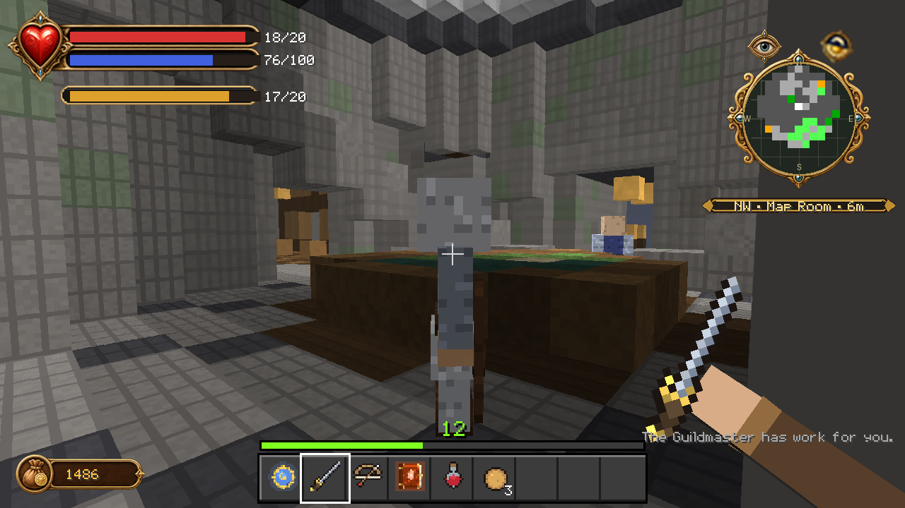

The Guildmaster's room and the hub of the building. A low wood-framed
land-and-sea relief of Albion fills the centre — it replaced an earlier jewel
mosaic during the conformance work. The **Cullis Gate** hums in the south-west
nook and the green **Skill Shrine** waits to the north-west.

### The Library

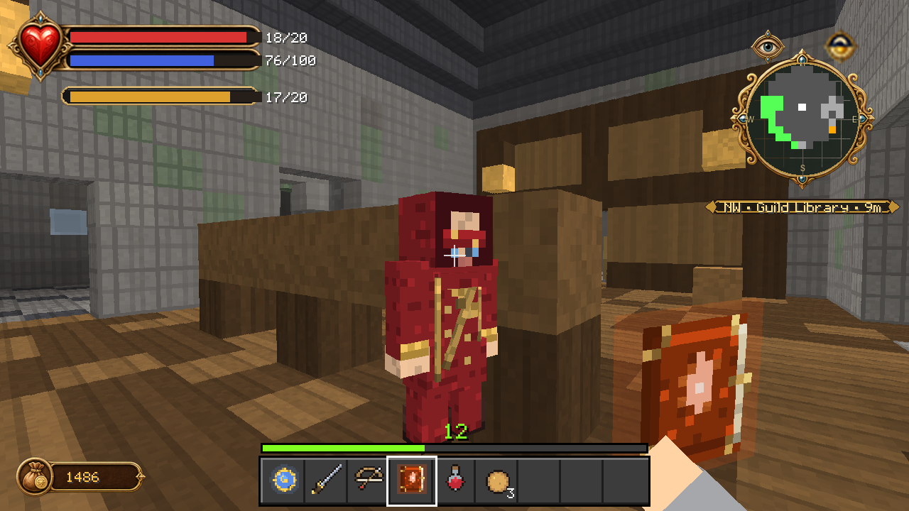

Continuous framed cases, a reading desk, supported lamps, and usually an
apprentice or two. Theresa is often here.

### The Chamber of Fate

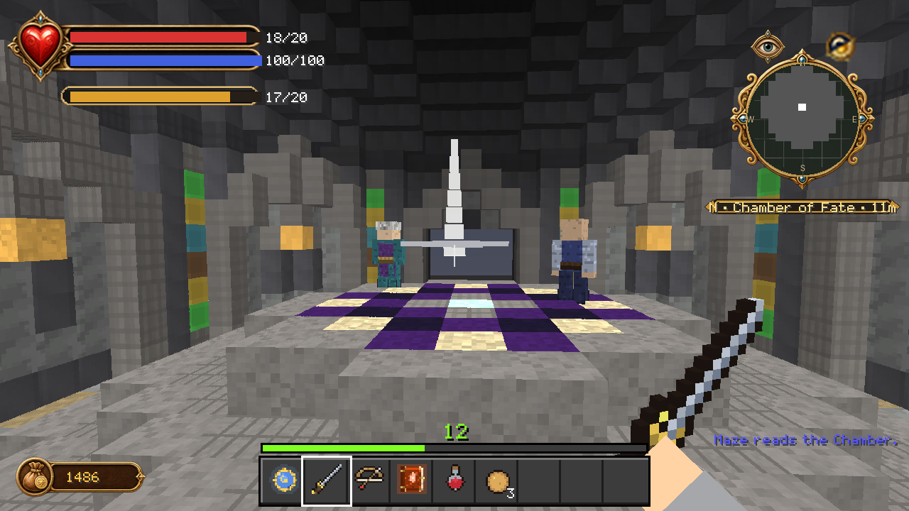

Its own 31 × 20 × 31 structure rather than a room in the hall. Pointed wall
bays, inset panels and coloured window strips. Maze reads what is coming here,
and this is where the story ends.

### Maze's study

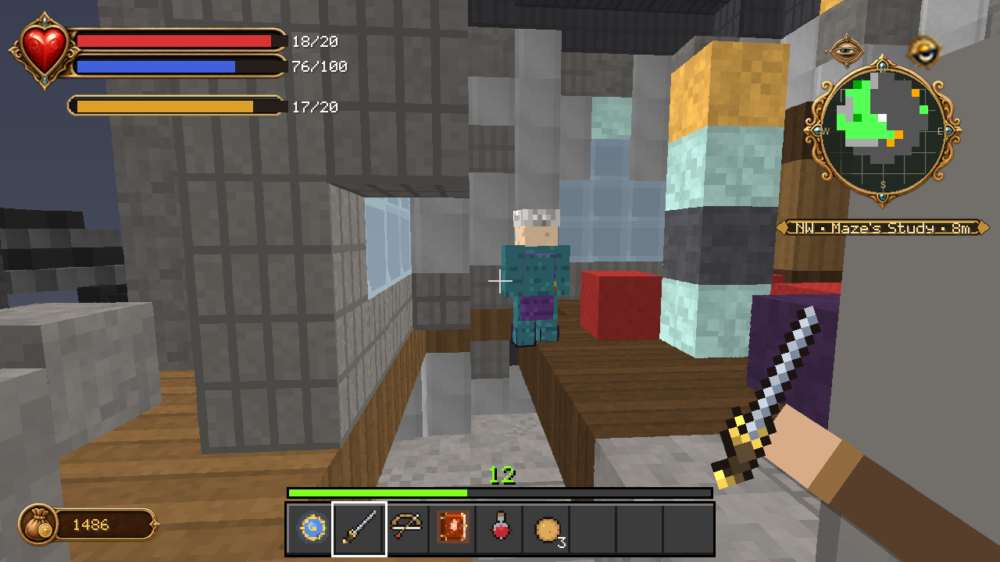

At the top of the tower — supported timber cases and a restored red rug. The
tower top is split by a wall; the study is its northern half.

### The dormitory

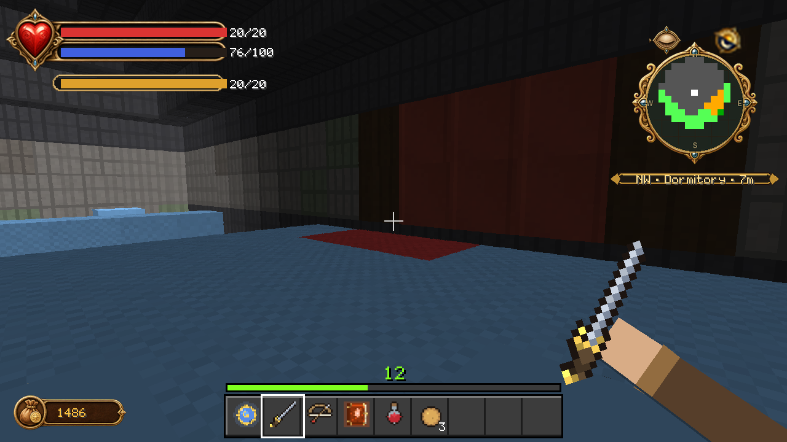

Where the apprentices sleep, behind a partition with a framed red bay.

> Worth knowing: the sleeping hall currently has **no light source within
> fourteen blocks**. It is the darkest room in the building, and that is a gap
> in the build rather than a deliberate choice.

### The training grounds

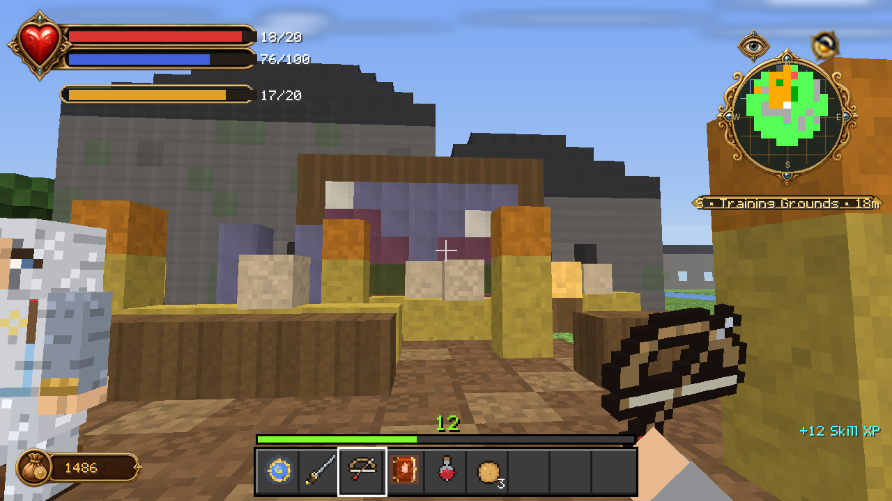

The east yard: an archery range with a scenic valley backboard behind the
firing lanes, a sparring ring, and a Will circle.

---

## The towns

| Place | Size | Who you meet |
|---|---|---|
| **Bowerstone Market** | 37 × 21 × 59 | Guards, a trader, a barkeep, townsfolk, Lady Grey |
| **Oakvale** | 53 × 14 × 35 | Farmers, fishers, Oakvale guards |
| **Oakvale Quay** | 29 × 15 × 29 | Fishers and quay guards |
| **Knothole Glade** | 35 × 15 × 35 | Villagers, guards, mercenaries |
| **Hook Coast** | 37 × 20 × 37 | The Oracle, Snowspire guards |
| **Snowspire Oracle** | 29 × 18 × 31 | The Oracle and her keepers |

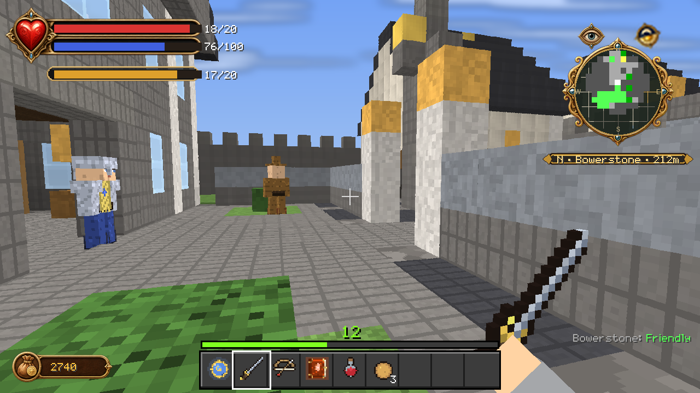

Each town is a **Cullis destination** once you have been there.

---

## Places of power and peril

| Place | What it is |
|---|---|
| **Temple of Avo** | Donations raise your morality. Altar of Light. |
| **Chapel of Skorm** | Sacrifices sink it. Altar of Shadow. |
| **The Arena** | Waves of beasts, then the champion's purse |
| **Lychfield Graveyard** | Hollow men that refuse to stay down |
| **Bargate Prison** | 41 × 20 × 49 of it |
| **Necropolis Ruin** | Wraiths, undead knights, frost balverines |
| **Witchwood Stones** | Standing stones where balverines hunt by moonlight |
| **Bandit Camp** | Twinblade's people, and sometimes Twinblade |
| **Darkwood Camp** | Hobbes, on the road where traders vanish |
| **Hobbe Cave** | Where lost children end up |
| **Greatwood Gorge** | And the door in its wall |
| **Archon Shrine / Archon Folly** | The bloodline's own monuments |
| **Grey House**, **Rose Cottage**, **Orchard Farm**, **Fisher Creek**, **Windmill Hill**, **Lookout Point** | Albion's smaller corners |
| **Silver Key Ruin** | One of fifteen hidden keys |

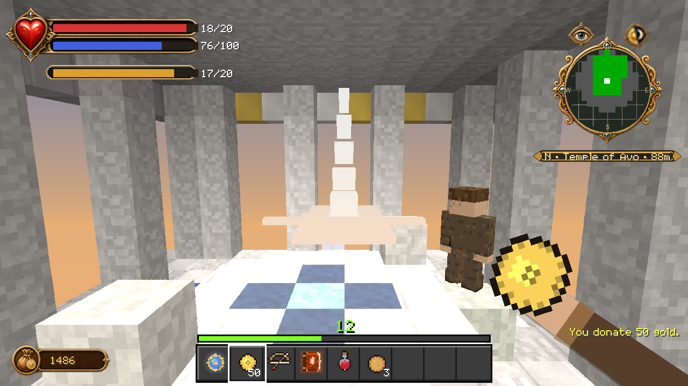

---

## Cullis Gates

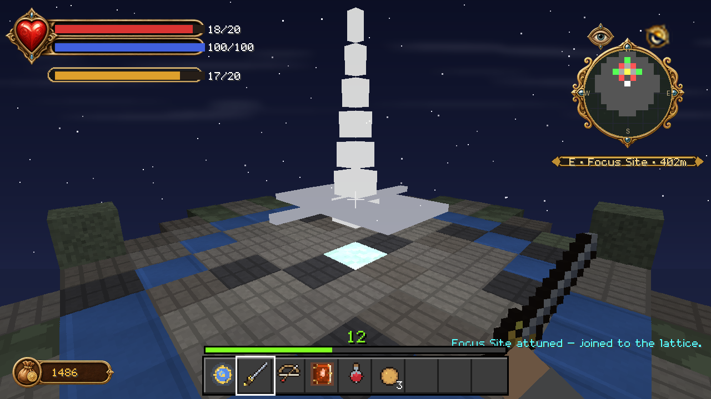

Fable's fast-travel network, rebuilt as something you assemble rather than
something you are given.

The Guild's Map Room holds one gate. Every **Focus Site** you find in the wild
is another — a 13 × 10 × 13 stone ring that joins the lattice once attuned.
Towns register themselves as destinations when you arrive.

Stand on a gate and **sneak** to open the travel list. Distances are real and
shown.

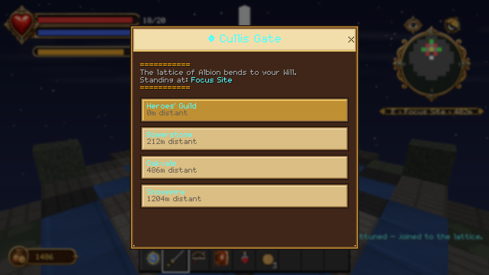

The Map page of the storybook menu is the same list, plus Guild recall. It is
deliberately a destination list and not a golden breadcrumb trail — *The Lost
Chapters* has no breadcrumb, and Fablecraft follows TLC rather than Fable II.

---

## Demon Doors

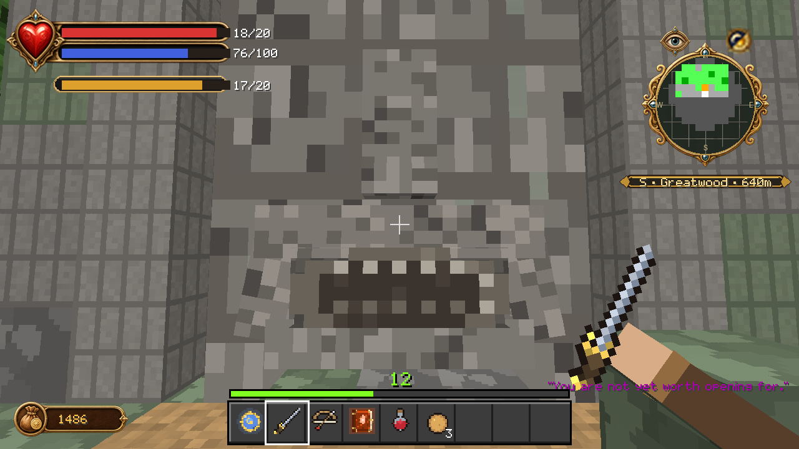

Eight Demon Doors: **the Gourmand, the Warrior, the Judge, the Corrupted, the
Hoarder, the Moonlit, the Riddler** and **the Arboretum Door**.

All eight are living stone faces set into hillsides. All eight talk, judge you
by your morality, your gear, your deeds and sometimes by what you are holding,
and refuse you in character when you do not measure up.

**Two of them currently open into reward worlds you can walk through.** The
other six are conversation and judgement only — the traversable-portal work is
in progress, and this is the honest state of it.

### The Library Arcanum

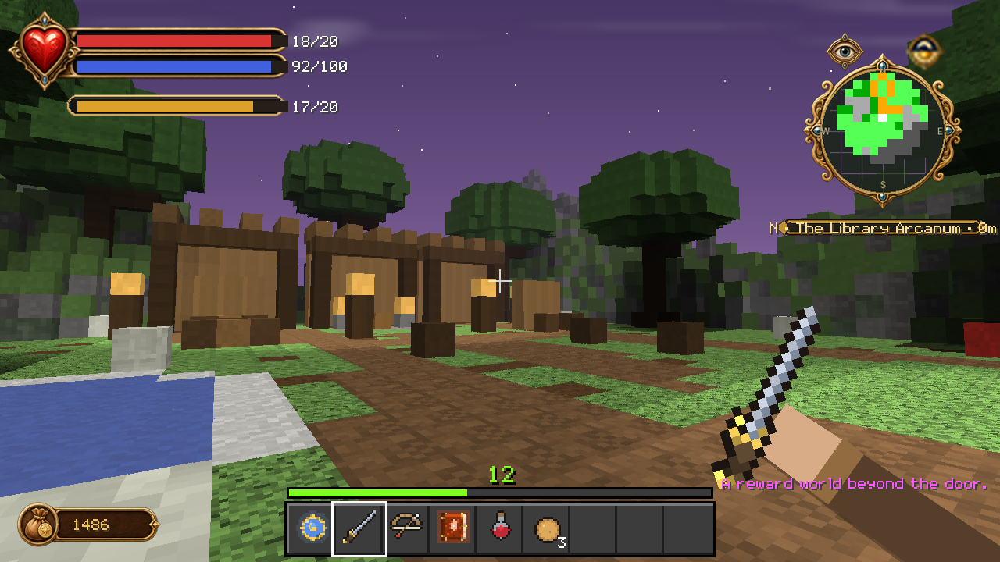

Behind the Guild's lamp door. A 49 × 28 × 49 world of its own, holding an
**Elixir of Life** and three books — *Making Friends*, *Book of Spells* and a
*Howl Tattoo*. Containers are seeded once, by the runtime, on your first
admission.

### The Arboretum

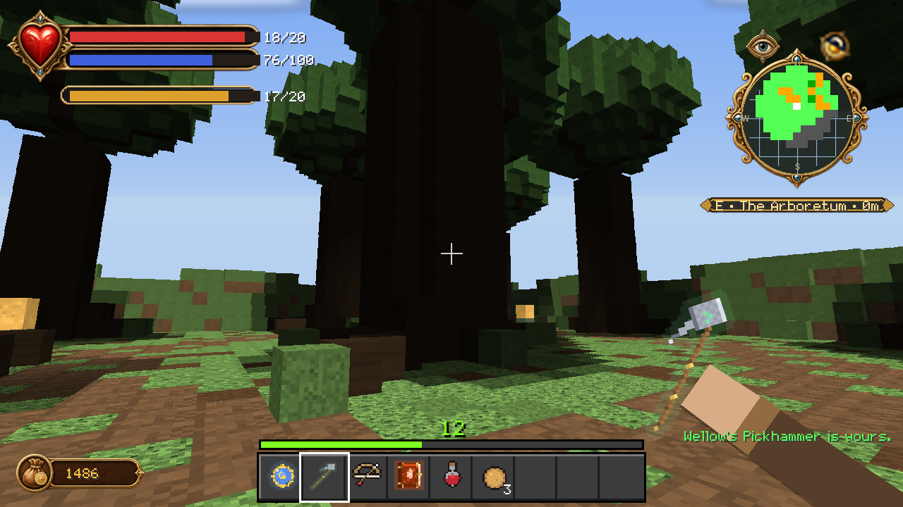

Behind the Greatwood Gorge door. Another 49 × 28 × 49 world: nine rooted trees,
a walking loop with eleven waypoints, and **Wellow's Pickhammer** at the end of
it.

Both realms live far out in world storage rather than in your world proper, are
bounded by an invisible shell, and return you to the door you entered by.
Design and implementation notes are in
[DEMON_DOOR_DESIGN.md](DEMON_DOOR_DESIGN.md).
