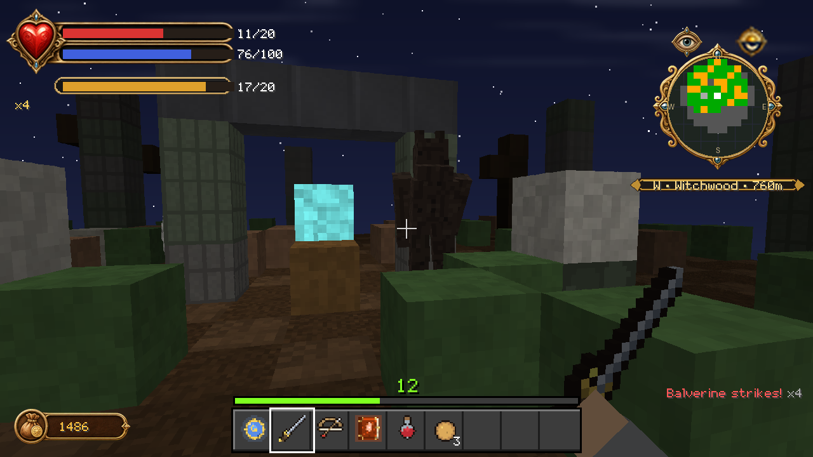

# Bestiary

Fifty-one creature and NPC definitions, which become 55 behaviour-pack entity
files once player and overlay assets are counted. Every model, texture and
animation is generated from `scripts/fc_mobs.py` and `scripts/gen_entity_textures.py`.

---

## They move

The thing most worth knowing about this roster is that none of it slides.

Every villager, guard, Guild member and named character walks with alternating
limbs and a weight-shifted bob, breathes on idle, looks around, gestures while
talking and follows through on attacks. Identical townsfolk are **phase-offset**
from one another, so a crowd never steps in lockstep — which is what makes a
market read as a market rather than as a row of copies.

The animation audit is in [ANIMATION_AUDIT.md](ANIMATION_AUDIT.md).

---

## What things are worth

Killing is the main way you earn, and the ledger cuts both ways.

| Creature | General XP | Morality |
|---|---:|---:|
| **Jack of Blades / Jack Dragon** (boss) | 400 | **+50** |
| **Twinblade** | 400 | +25 |
| **Troll** (earth, ice, rock giant) | 120 | +10 |
| **Frost Balverine** | 80 | +12 |
| **Banshee** | 60 | +8 |
| **Summoner** | 55 | +6 |
| **Assassin** | 50 | +6 |
| **Wraith** | 45 | +6 |
| **Balverine** | 35 | +8 |
| **Minion** | 30 | +5 |
| **Bandit / Bandit Archer** | 18 | +5 |
| **Undead** (hollow man, soldier, knight) | 15 | +6 |
| **Hobbe / Hobbe Scout** | 12 | +3 |
| **Wasp / Wasp Queen** | 6 | +1 |
| **Beetle** | 4 | 0 |
| **Nymph** | 5 | **−20** |
| **Guard** | 10 | **−150** |
| **Trader** | — | **−120** |
| **Villager** | 2 | **−100** |

Killing a guard is the single most damaging thing you can do to your alignment
short of sacrificing at an Altar of Shadow — and it also opens a bounty on that
settlement. Killing a nymph costs you alignment even though nymphs are not
townsfolk.

Melee kills also grant Strength XP and ranged kills grant Skill XP, on top of
the General XP above, all multiplied by your combat multiplier.

---

## The hostile roster

### Beasts

**Balverine** · **White Balverine** · **Frost Balverine** — the werewolves of
Albion, and the reason the Silver Augmentation exists. The White Balverine
stalks Knothole Glade and is a quest in its own right.

**Earth Troll** · **Ice Troll** · **Rock Giant** — slow, enormous, and worth
120 XP each.

**Wasp** · **Wasp Queen** · **Beetle** · **Arachanox** — the small things,
except the Arachanox, which is not small.

### Hobbes

**Hobbe** · **Hobbe Scout** — they infest Darkwood and the Hobbe Caves, and
they do terrible things to lost children.

### The dead

**Undead** (hollow men) · **Undead Soldier** · **Undead Knight** ·
**Wraith** · **Banshee** — Lychfield and the Necropolis.

### People who want you dead

**Bandit** · **Bandit Archer** · **Mercenary** · **Assassin** ·
**Summoner** · **Minion** — Twinblade's war-camps, and the assassins that
renown buys you at night.

**Nymph** — beautiful, and not on your side.

### Bosses

**Twinblade**, the Bandit King, 400 XP and +25 morality.

**Jack of Blades**, and then **the Jack Dragon**, when you thought you were
done.

---

## The living

### Townsfolk

**Villager of Albion** · **Villager Woman** · **Farmer** · **Fisher** ·
**Tailor** · **Blacksmith** — they walk, work, react to your expressions and
remember your reputation.

### Guards

**Bowerstone Guard** · **Oakvale Guard** · **Snowspire Guard** — each wears its
town's colours, each enforces its town's bounty on you, and each will attack on
sight if you have made that town hostile.

### Traders

**Trader** · **Barkeep** — prices move with your reputation, and they refuse to
serve you outright if you are hostile.

### The Guild

**Guildmaster** — the Map Room, the quests, and the voice in your ear.

**Guild Apprentice (Might / Skill / Will)** — three apprentices who train in the
yard and have their own things to say.

**Maze** — the Chamber of Fate and the tower study.

**Theresa** — your sister, usually in the Library.

### Named characters

**Lady Grey**, Mayor of Bowerstone, who wants a black rose.

**Briar Rose**, the other Hero.

**The Oracle** of Snowspire, who remembers everything.

**Demon Door** — eight of them, and they are entities, not blocks. They see you
coming, they talk, and they judge.

---

## Summons

**Summoned Wasp** · **Summoned Hobbe** · **Summoned Balverine** — what the
**Summon** power calls. Two at a time, and one that kills is refreshed by the
kill. See [WILL.md](WILL.md#companions).
