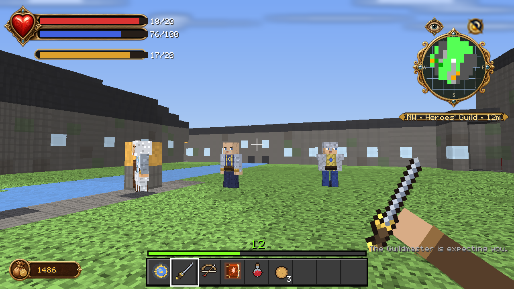

# Getting started

Fablecraft: Reforged is a Minecraft Bedrock add-on. It installs as one
`.mcaddon` containing a behaviour pack and a resource pack, and it needs the
Script API, so it runs on Bedrock **1.21.100 or newer** with scripting enabled.

---

## What you need

| | |
|---|---|
| **Minecraft** | Bedrock Edition 1.21.100+ (Windows, mobile, or console via a realm host) |
| **Script modules** | `@minecraft/server` 2.1.0 and `@minecraft/server-ui` 2.0.0 — both ship with that version |
| **World settings** | Whatever beta/experimental scripting toggle your Minecraft version requires |

Java Edition is not supported and there is no plan to support it. The add-on is
built entirely out of Bedrock behaviour/resource pack formats and the Bedrock
Script API.

---

## Installing

There is no public release build. `LEGAL.md` gates distribution until the
original-name branding mode and its package scan are finished, and the archives
tracked in `dist/` predate that policy — treat them as historical artefacts, not
as releases. So for now, installing means building:

```bash
python scripts/build_addon.py
```

The build prints the exact output path, which looks like
`tmp/builds/faithful-<run>/dist/Fablecraft_Reforged.mcaddon`. Then:

1. Open the `.mcaddon` with Minecraft (double-click on desktop). Both packs
   import together.
2. Create a new world. Under **Behavior Packs**, activate
   *Fablecraft: Reforged — Will & Destiny [Behavior]*. The resource pack
   activates automatically as a dependency.
3. Turn on the scripting/experimental toggles your version asks for.
4. Load the world.

If you would rather install the two packs separately, the same build folder
contains `Fablecraft_BP.mcpack` and `Fablecraft_RP.mcpack`.

See [BUILDING.md](BUILDING.md) if the build itself is what you care about.

---

## Your first ten minutes



You wake inside the **Heroes' Guild** wearing a full apprentice outfit and
carrying a Stick, a **Guild Seal**, a Quest Card and an Apple Pie. The
Guildmaster is expecting you.

**1. Open the Guild Seal.** Use it and the storybook menu opens — eleven pages
covering every scripted system in the add-on. It is the only interface you need
to learn; everything else routes through it. See [INTERFACE.md](INTERFACE.md).

**2. Read the HUD.** The pack replaces Minecraft's hearts, hunger and armour
bar outright. Health, Will and stamina live in the ornate frame at top left,
your renown stars sit top centre, the detection eye and day dial with the
terrain radar sit top right, and your purse is bottom left. The vanilla hotbar
and XP bar are the only vanilla HUD pieces left.

**3. Use the Quest Card.** It starts *Join the Heroes' Guild*, which walks you
into the training grounds in the east yard — an archery range, a sparring ring
and a Will circle.

**4. Kill something.** Every kill grants General XP plus either Strength
(melee) or Skill (ranged); casting grants Will XP. Slain enemies drop coloured
experience orbs in Fable's four colours. Your **combat multiplier** climbs with
every unanswered hit and multiplies what you earn — then shatters the moment
you take damage.

**5. Spend it.** Guild Training, reached from the menu, converts XP into
Physique, Health, Toughness, Speed, Guile, Accuracy and Magic Power.

---

## The things that surprise people

**The Guild Seal is also your way home.** Sneak-use it to recall to the Guild
from anywhere.

**Fast travel is a network you build.** The Cullis Gate in the Guild's Map Room
is one node. Every **Focus Site** you find in the wild joins the lattice once
attuned. Stand on a gate and sneak to open the travel list.

**Crime is local and it remembers.** Kill a villager or a guard and that
*specific settlement* raises a bounty on you. The guard response scales with
it. See [HERO.md](HERO.md#crime-bounties-and-jail).

**Eating matters morally.** Crunchy Chicks rot you; pure food lifts you.
Morality runs −1000 to +1000 and changes dialogue, spell access, Demon Door
verdicts and eventually your appearance.

**Most Demon Doors do not open yet.** Eight exist and all eight talk to you and
judge you. Two — the Guild's Library Arcanum and the Greatwood Gorge Arboretum
— currently lead to full reward worlds you can walk into. See
[ALBION.md](ALBION.md#demon-doors).

---

## Commands

The add-on is playable without commands. These exist for testing and for
players who want them:

| Command | Effect |
|---|---|
| `/fable:emote <name>` | Perform one of the 31 expressions |
| `/scriptevent fc:wanted` | List your active warrants |
| `/scriptevent fc:clearwanted` | Drop all your warrants |
| `/scriptevent fc:reanchor` | Re-derive the Guild's Cullis, Skill and Boast anchors |

---

## Where to go next

- [HERO.md](HERO.md) — XP, training, morality, factions, crime, titles
- [WILL.md](WILL.md) — the eighteen Will powers and the Will Focus
- [FORGE.md](FORGE.md) — the smithing chain, weapons, armour, augments
- [ALBION.md](ALBION.md) — the Guild, the towns, the Demon Doors
- [BESTIARY.md](BESTIARY.md) — what lives out there and what it is worth
- [QUESTS.md](QUESTS.md) — the fifteen quests
