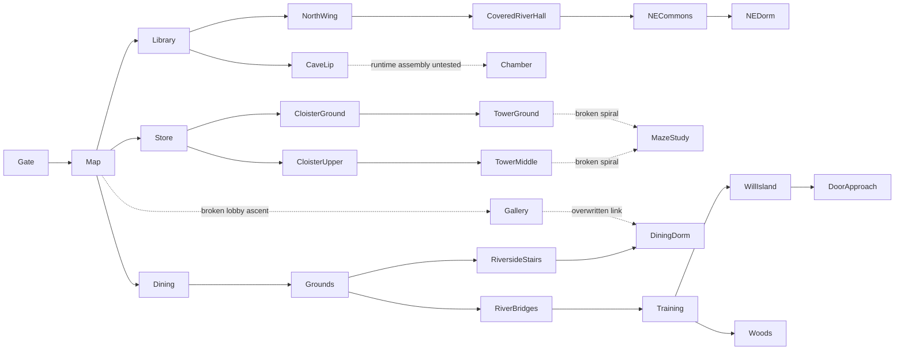

# GP1 Guild geometry and reference audit

Audit date: 2026-09-12. Scope: current generated `guild_hall`, its connected rooms,
vertical routes, adjoining grounds and reference provenance. No geometry/runtime
change is part of GP1. Baseline source digest, sampled blocks and routes are in
`screenshots/validation/GP1/geometry/route-probe.json`; the companion script
captures the generator without writing structures. All checks here are offline.
No Bedrock walkthrough or NPC pathfinding execution was available.

## Reference confidence and conflicts

- **High for source provenance:** the original local reference directory exists at
  `/run/media/eclipse/8E025A94025A80DF/Users/Eclipse/.claude/skills/fable-tlc-expert/references/`.
  It contains the same six named reference documents as the repository snapshots.
  `HeroesGuild_BuildSpec_SAMPLE.md`, referenced by FullWorld line 3, is absent there.
  Do not invent its proportions or mark its instructions reviewed.
- **Medium for historical layout:** `docs/references/fable-tlc-expert/architecture.md:53`
  describes the western map/quest/experience/Cullis functions, eastern dining,
  southern shop, northern library/cave, upstairs sleeping spaces and separate Maze
  tower. Its own caveats say some materials/proportions derive from fan prose.
  Three dormitory rooms and a two-bridge Will island need actual TLC views before
  counting them as precise geometry requirements.
- **High for project intent, insufficient for TLC fidelity:** the local historical
  `memory/guild-rebuild-plan.md` explicitly identifies the user's Inkarnate plan
  (`Screenshot 2026-06-13 150337.png`) as the old overlay target. The original
  Downloads path is unavailable on Linux; preserved `scripts/_align/` composites
  are derived comparisons. The June 17 notes record a user-requested single island,
  no large paved plazas and a unified hall. Retain those preferences unless new
  original-game evidence justifies a coherent redesign. The target classifier is
  parameterized from `GUILD_LAYOUT`; agreement with it cannot independently prove
  TLC resemblance.
- **External corroboration, limited:** [GameBanshee's Guild walkthrough](https://www.gamebanshee.com/fable/walkthrough/mapheroesguild.php)
  locates the dining area east and library/cave exit north. A contemporary
  [TLC walkthrough](https://gamefaqs.gamespot.com/pc/926702-fable-the-lost-chapters/faqs/33342)
  places Will practice on the island immediately before the southern Demon Door.
  These support adjacency, not dimensions or bridge count. The mixed-version
  Fable Wiki gallery explicitly contains an Anniversary training view, which
  must not be used to grade 2005 geometry accidentally. The official Xbox-hosted
  TLC manual fetch timed out and MobyGames' TLC interior page returned 403 during
  this audit; neither counts as an inspected image.

## Ranked defect ledger

| Rank / ID | Evidence and player consequence | Candidate next fix / acceptance |
| --- | --- | --- |
| 1 / G-GEO-01 | Maze's exact standing anchor `(46,12,70)` has floor and headroom but is disconnected in the route probe. The rounded spiral omits adjoining tread cells: after `(49,1,75)`, the next inner tread is `(47,2,75)`, with column `(48,*,75)` empty through y5. The later inner-rail pass replaces 17 of the 22 intended inner treads with fences. Owners: `scripts/gen_structures.py:1567` and `:1685`–`:1697`. | Replace the sparse rounded sample path with an explicitly connected stair flight and landings; keep all lower entries and the study anchor. Reserve tread/headroom volumes from rails, shelves and floors. Check every transition in both directions and inject an independent missing-step failure. No repeated runtime clear/teleport repair as a substitute. |
| 2 / G-GEO-02 | The rotunda gallery `(31,10,42)` is standable but disconnected. Its intended descending bridge to the dining dormitory is overwritten: `(35,8,42)` is air, `(35,9,42)` is a roof tile, `(36,7,42)` is air and the doorway has solid wall at y10/11. The dining dormitory is reachable through the external riverside stairs, which masks failure of the internal route. Owners: bridge at `scripts/gen_structures.py:1047`, wall/door at `:1111`–`:1120`, later `join_bay(35,34,35,50,8,'x')` at `:1211`. | Construct final connected stairs/gallery/link from one explicit route definition after intersecting room shells, with supported doorway threshold and two-cell minimum headroom. Ensure both wrapped lobby flights reach the gallery and both gallery/dining directions work; verify ground arches remain open. |
| 3 / G-GEO-03 | Existing `_verify_guild.py:172` tower audit samples only expected outer tread columns, compares vertical heights and accepts lantern as headroom. It never connects adjacent treads, measures a player's crossing volume, validates inner rails or proves the study can be reached. C2 checks anchor clearance, not route reachability. | Add final-voxel route regression covering the living spaces and Maze from the same entrance component, plus local step/landing/collision assertions. Preserve separate statements for full-block offline connectivity and unrun engine walking. |
| 4 / G-GEO-04 | The authored island is a small scarecrow area, with one diagonal bridge from the east bank (`GUILD_LAYOUT` lines 325–326; builder `:1997`–`:2102`). Both river bridges at z36/z54 cross directly bank-to-bank. The snapshot describes two bridges to the Will island. No active Will lesson occupies this island in the current training anchors. | Verify original manual/map + TLC gameplay before changing water/bridge topology. Improve the island's purpose in GP3/next geometry pass with coupled station/spawn routes. A second bridge cannot be labeled canon merely from the snapshot. |
| 5 / G-GEO-05 | Sleeping accommodation is a long unpartitioned room above dining plus four unpartitioned rug/bunk groups in the large NE block and two north-wing bunks (`:1100`–`:1125`, `:1387`–`:1420`, `:1020`). The snapshot describes three dormitory rooms upstairs. The large NE range and broad flat roof connections dominate the silhouette in the baseline. | Obtain original interior/exterior views; design actual room boundaries, shared access and furnishings from those views. Keep three-room wording provisional until verified. Fix serious route defects first. |
| 6 / G-GEO-06 | Cave access is an obvious open stone alcove and downward shaft, not a concealed bookcase route (`:970`–`:988`). The underground connector depends on runtime carving and repair; a structure-only render does not contain its full route. `chamber_of_fate` (`:3693`) provides a circular room but generic glazed panels and a terraced block mound, with an artificial glass/water/glowstone skylight. | Audit assembled runtime cave/Chamber geometry separately, including terrain exclusion and entrance heights; obtain original fresco/platform views. Keep the existing cave exclusion and saved-world position until a versioned migration is designed. |
| 7 / G-GEO-07 | The map relief is randomly selected lapis/moss/sand/emerald/gold blocks with a central sea-lantern/end-rod marker (`:806`–`:823`); it supplies no authored Albion shape. Grey masonry generally matches textual direction, but bright lamps and decorative blue blocks are Minecraft adaptations. Baseline render contains magenta fallback colors for some unresolved renderer materials. | Replace the random relief with an original, reference-led authored landform and coherent painterly palette. Do not judge the actual game color from renderer fallback magenta, and do not use an S image score to claim likeness. |

Ranks 1–3 form the first coherent GP2 pass: connected vertical circulation through
the main hall and Maze tower, retaining current gameplay anchors. This is a layout
fix with immediate access implications; detailed decoration should follow it.

## Room and route review

The probe starts at the waking point `(20,1,42)`. It models cardinal movement,
two clear standing cells and at most one full block of rise/drop. Listed plants
and carpets are treated as passable; slabs/stairs are approximated as full cubes;
fences/walls are excluded as walking floors. It checks departure overhead when
rising. This is deliberately **not a Bedrock collision simulator**, and a passing
route may still require jumping. Negative cases above are corroborated by exact
missing/overwritten blocks, not inferred solely from the graph.

| Place / adjoining route | Baseline finding |
| --- | --- |
| West entrance → map vestibule | Connected; gate `(10,1,42)` reaches wake. Three-wide central passage with framed overhead arch. |
| Map → quest/Cullis/skill | Approach sides connected; quest block is furniture rather than a standing cell. Current anchors remain fixed. |
| Map → library → north wing | Connected at sampled ground level. Library shelves and central aisle are clear. Cave lip `(27,1,16)` reachable, descent itself untested here. |
| Map → store → lower cloister | Connected, including `(22,1,69)`. Shop goods are generic storage props; exact shop elevation/proportions remain reference work. |
| Map → dining → upper dining | Ground hall connected. Upper dormitory `(40,8,45)` reachable using external riverside stairs. Internal gallery bridge fails (G-GEO-02). |
| North wing → covered river hallway → NE stores/commons | Connected in offline graph. Roofed hallway is narrow; engine collision/headroom and two NPCs passing remain unrun. |
| NE commons → upper dormitory | Sample `(91,6,20)` reachable; simplified stair collision may hide jumping. Room subdivision differs from snapshot expectation. |
| Store → upper cloister → tower middle | Upper cloister sample connected; tower's sampled center at `(46,7,70)` is itself occupied by fence and is not a valid destination. Nearby stair pieces can be reached from the cloister; that does not connect the complete tower spiral. |
| Garden/lower cloister → tower ground → Maze study | Ground entrance `(46,1,70)` connected. Study anchor is disconnected; local standing clearance alone does not make Maze accessible. |
| West grounds → river bridges → training | Both bridges, archery and melee sample points connected. This says nothing about target motion or apprentice AI. |
| East bank → Will island → Demon Door approach | Island and approach `(66,1,88)` connected. Door's stone-face aperture/portal transition is DP scope. |
| Training → Guild Woods exit | East edge `(119,1,32)` connected; beyond-structure world path depends on runtime terrain. |

## Baseline views and actual commands

New source-captured images under `screenshots/validation/GP1/geometry/`:

- `baseline_exterior.png`: campus exterior.
- `baseline_ground_cutaway.png`: y≤3 cutaway, north up; reveals ground layout.
- `baseline_hall_cutaway.png`: y≤10 cutaway; hall, gallery and living-space context.
- `baseline_tower_cutaway.png`: y≤13 cutaway; study/tower context.
- `route-probe.json` and `.log`: destinations, exact paths for successful samples,
  all intended tower treads and exact bridge/gap blocks.
- `audit_baseline.py`: reproducible capture/probe/render command, run with
  `PYTHONPATH=scripts python screenshots/validation/GP1/geometry/audit_baseline.py`.

The existing `_guild_topdown.png` and `_guild_crop_noroof.png` were also inspected,
but the newly captured GP1 images are the baseline of record. Renders expose
shape only: no collision, NPC animation, terrain assembly or portal execution.

## Compatibility and next acceptance

GP2 should retain `GUILD_LAYOUT.size`, all `GUILD` interaction/spawn coordinates,
Maze `(46,12,70)`, cave shaft/exclusion, ticking bounds and C2 anchor assertions.
Change the generator, then regenerate only the affected owned structure and its
contract metadata/renders. A future placement uses the corrected stairs; a
saved occupied Guild must not be silently reloaded or overwritten. Reanchor
refreshes coordinates only and is not a geometry upgrade. Track any saved-world
migration as a separate versioned, bounded operation.

Require regression coverage for both directions, every threshold and landing,
actual final geometry after all decorator passes, adjoining ground arches, and
independent broken-step/blocked-headroom/removed-bridge fixtures. Follow offline
validation with a manual walk from the front gate through both lobby flights,
dining dormitory, cloister and Maze study, and an NPC route exercise. Those
engine checks remain **unrun** until an actual Bedrock session supplies evidence.
