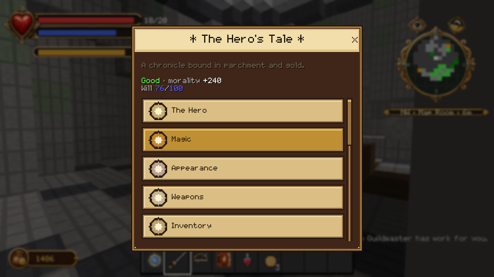
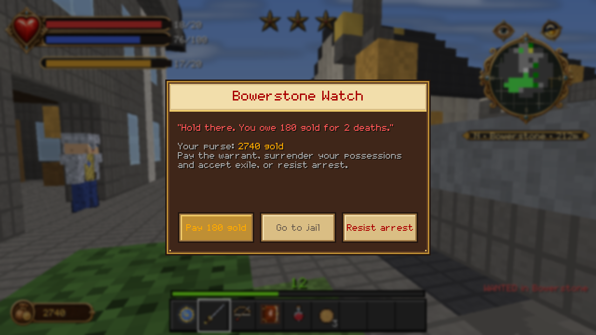

# The interface

Two pieces: a HUD that replaces most of Minecraft's own, and a storybook menu
that fronts every scripted system in the add-on.

---

## The HUD

`packs/Fablecraft_RP/ui/hud_screen.json` switches Minecraft's **hearts, hunger
and armour bar off outright** and puts the Fable layer in their place. The
vanilla hotbar and XP bar are the only vanilla HUD pieces that survive.

Everything the HUD shows arrives as a **single action-bar payload** from
`fable_hud.js`, which the UI then slices into windows with `clips_children`.
That is an unusual way to build a Bedrock HUD and it is the reason the layout is
so exact about line offsets: each frame scrolls one payload line into one
window.

| Where | What |
|---|---|
| **Top left** | Ornate status frame — health, Will and stamina bars with values |
| **Below it** | Combat multiplier, when you have one |
| **Top centre** | Wanted stars, whenever a warrant is live |
| **Top right** | Detection eye (open / partial / closed) and the day dial |
| **Below those** | Terrain radar, an 11 × 11 dial oriented to your view |
| **Under the radar** | Navigation line — heading, nearest place, distance |
| **Bottom left** | Coin purse |
| **Bottom right** | Action-bar notices — XP gains, combat feedback, dialogue |
| **Bottom centre** | Vanilla hotbar and XP bar |

**The detection eye** tells you whether anything has noticed you: open means
you are seen, partial means something is suspicious, closed means you are
unobserved. It is the stealth read.

**The day dial** rotates so the current segment of the day sits under a fixed
top reading position, rather than drawing a hand that travels round the face.

Normal play stays sparse deliberately. Combat feedback is short action-bar
notices, not floating numbers.

The HUD has its own static audit — `scripts/audit_hud.py` checks every frame
and clip against target zones, and `scripts/preview_hud_faithful.py` renders
what the real payload actually produces through the live clip offsets. Findings
live in [../screenshots/ui/HUD_AUDIT.md](../screenshots/ui/HUD_AUDIT.md).

---

## The storybook menu

Use the **Guild Seal** and *The Hero's Tale* opens — a `@minecraft/server-ui`
form wearing a skin the resource pack supplies: dark leather panels, warm
parchment controls, gilt trim.

Eleven pages:

| Page | What it does |
|---|---|
| **The Hero** | Renown, XP, training, titles, alignment |
| **Magic** | Upgrade powers, assign the three quick-cast slots, attune the Will Focus |
| **Appearance** | The overlay rig — auras, horns, halo, detail level |
| **Weapons** | Inspect damage and augment slots, equip any carried weapon |
| **Inventory** | Use provisions and experience orbs, open Quest Cards, route augmentation stones into the forge |
| **Clothing** | Equip individual pieces or complete four-piece suits |
| **Expressions** | All 31 social actions, grouped by category |
| **Quests** | Active card, available work, completed history |
| **Factions** | Standing with all five factions, and your bounties |
| **Map of Albion** | Discovered Cullis destinations and Guild recall |
| **Logbook** | Titles, bounties, system help, and how Albion works |

The header shows your alignment title, your morality number and your Will.

**Sneak-use the Seal** to skip the menu and recall straight to the Guild.

### Why there is no breadcrumb trail

The Map page is a destination list. It does not draw a golden trail to your
objective, because *The Lost Chapters* does not have one — that is Fable II.
This is a deliberate omission, not a missing feature.

---

## Forms you will meet

Menus, shops, dialogue and prompts are all Bedrock server-UI forms in the same
skin.

**Shops** support buy-one, buy-maximum, sell-one, sell-maximum and an exact
quantity slider. The header shows your purse and your reputation tier with its
price effect spelled out.

**Warrants** show the settlement, what you are charged with, the fine, your
purse, and the three ways out.

**The Cullis list** shows each discovered destination with its real distance.

---

## A note on the button skin

The pack draws its own button textures and declares their nine-slice metadata
in `scripts/gen_ui.py`. Those buttons carry a one-pixel bevel highlight at
row/column 2; the slice was declared at 2 as well, which left the bevel inside
the *stretched* centre region, so Bedrock smeared that single highlight pixel
across a quarter of every button. The slice is now 3, which puts the bevel in
the fixed edge bands and leaves a uniform centre to stretch.

If you regenerate the UI skin, that is the reason the four
`button_borderless_*.json` files say `"nineslice_size": 3`.
