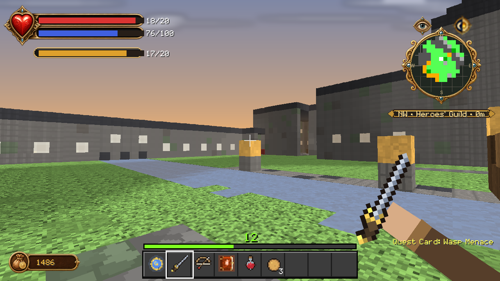

# About the imagery

Almost every picture in this repository is **rendered by code, not captured
from Minecraft**. That is worth stating plainly at the top, because rendered
images of a game are easy to mistake for screenshots of one, and a reader
deciding whether to install something deserves to know which they are looking
at.

There are four image sets. Three are renders. One is not.

---

## 1 · Genuine captures — `screenshots/ingame/`

Two files, both photographed in a running Minecraft Bedrock client:

- `hero_good_paladin_halo.jpg`
- `hero_evil_avatar_of_skorm.jpg`

They show the same Hero at the two ends of the morality scale, with the
alignment overlay rig live. These are the only images in the repository that a
Minecraft client produced.

Wherever they appear, they are labelled as real captures.

---

## 2 · Staged captures — `screenshots/staged/`



Twenty-two frames at 1280 × 720, generated by
`scripts/gen_ingame_screenshots.py`. These are what the documentation leads
with, because they answer the question a catalogue plate cannot: *what does
this look like to play?*

**What is real about them**

- The geometry is the same `Vox` data that becomes the shipped
  `.mcstructure` files. Nothing is modelled for the picture.
- The camera stands on an actual floor at vanilla eye height (1.62 blocks),
  with a 70° field of view, and it can only see what a player standing there
  could see. Walls occlude. Rooms feel their real size.
- Block shading uses Minecraft's own directional constants (top 1.0, north/south
  0.8, east/west 0.6, bottom 0.5) and its light model — a source of level *n*
  reaches *n* blocks, losing one level per block.
- The HUD is composited from `packs/Fablecraft_RP/ui/hud_screen.json` at its
  real anchors and scale, using the real textures in
  `packs/Fablecraft_RP/textures/ui/fable_hud/`. If the pack moves a frame,
  these move with it.
- Menus are nine-sliced from the pack's own `dialog_background_hollow_3` and
  `button_borderless_light` textures, and every string in them is quoted from
  `packs/Fablecraft_BP/scripts/fc_strings.js` or from the form builders that
  produce them.
- Hotbar contents are validated against the real item textures; a shot
  referencing an item that does not exist fails the build rather than rendering
  an empty slot.

**What is not**

- No Minecraft client produced them. They are painted by PIL, using a
  painter's-algorithm perspective renderer in `scripts/fc_pov.py`.
- **Block surfaces are generated, not Minecraft's.** Each block type gets a
  16 × 16 field of brightness multipliers derived procedurally from its palette
  colour — plank grain, brick courses, cobble mottle, fabric weave. This is
  deliberate: `LEGAL.md` commits the project to assets that are "original or
  generated for this project", and baking Mojang's block textures into
  committed images would quietly break that. So a stone brick wall reads as a
  stone brick wall, but it is not *the* stone brick texture.
- Entity animation is not simulated. Mobs stand in their bind pose.
- Lighting skips occlusion — lamps shine through walls. Over a framed shot the
  difference is small; over a whole world it would not be.
- The HUD values (health, gold, renown, notices) are chosen per shot to
  illustrate the moment. They are plausible states, not a recording of one.

`screenshots/staged/INDEX.md` restates all of this, next to the shot list.

---

## 3 · Showcase plates — `screenshots/docs/`

Thirty 1920 × 1080 images from `scripts/gen_doc_screenshots.py`: isometric
dioramas of structures with mobs and spell effects composited in, plus
inventory, recipe and UI mock-ups, each captioned in a title band.

These are **catalogue plates**, not screenshots. The camera is orthographic and
outside the world, the structure floats on a gradient, and there is no HUD.
They are the right format for showing a whole building's layout at once and the
wrong format for showing what playing feels like — which is why the staged set
exists and why the README leads with it.

`screenshots/docs/INDEX.md` lists them.

---

## 4 · The catalogue — `screenshots/gallery/`, `mobs/`, `items/`, `recipes/`, `structures/`

Everything the project makes, rendered one thing at a time by
`scripts/gen_screenshots.py`, plus contact sheets per category. Every mob in
three-quarter view, every item icon on a framed card, every structure
isometric, every recipe as a crafting card.

This is a reference, and a flat grid is genuinely the best format for it. It is
also a visual audit: `screenshots/AUDIT.md` records measured coverage, colour
count, contrast spread and brightness per image, so a texture regression shows
up as a number rather than as something nobody notices.

---

## 5 · Evidence — `screenshots/validation/`

Per-checkpoint evidence for the TLC conformance ledger, keyed by leaf id
(`GP24/`, `DP10/`, `C1/` and so on). These belong to the engineering record, not
to the documentation. The ledger's own rule is worth repeating here:

> A mock or render is never an in-game pass.

Which is the same principle this page is built on.

---

## Regenerating

```bash
python scripts/gen_ingame_screenshots.py            # the staged set (all 22)
python scripts/gen_ingame_screenshots.py 03_map_room  # or one shot
python scripts/gen_doc_screenshots.py               # the showcase plates
python scripts/gen_screenshots.py                   # the catalogue and AUDIT.md
python scripts/preview_hud_faithful.py              # HUD through the live clip offsets
```

All four are deterministic. Re-running them on unchanged source produces
unchanged images, so a diff in `screenshots/` means something actually changed
in the packs.

---

## If you are adding an image

Say what it is. A render captioned as a screenshot is a small lie that
compounds: it sets an expectation the build cannot meet, and it makes the
genuine captures worth less. Renders are fine — this whole project is rendered
— as long as the caption is true.
