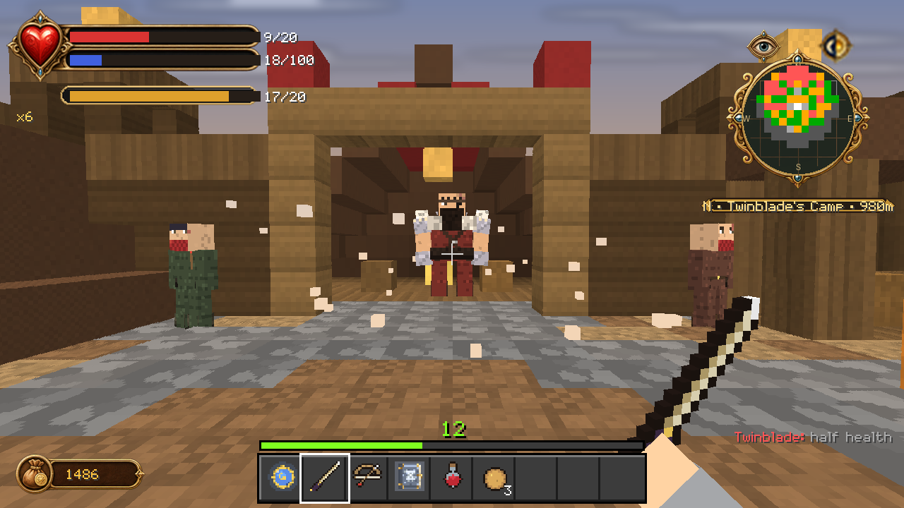

# Quests

Fifteen quests: a seven-step main chain, six side quests and two standing jobs.
They are tracked on your **Quest Card**, and the **Quests** page of the
storybook menu separates the active card, work available to you, and what you
have already done.

Renown gates what you are offered. Finishing quests is how renown grows, so the
chain opens itself as you go.

---

## The main chain

Seven quests, in order, from apprentice to the end of Jack of Blades.

### 1 · Join the Heroes' Guild
*Guildmaster · renown 10*

Show your Guild Seal. That is all — it exists to put the menu in your hands.

**Reward:** 100 gold · 50 General XP

### 2 · The Wasp Menace
*Guildmaster · renown 100*

Wasps swarm the picnic grounds. Slay the Wasp Queen before lunch is ruined
forever.

- Slay 8 Wasps
- Destroy the Wasp Queen

**Reward:** 200 gold · 200 General + 50 Strength XP · **+20 morality** · 2 Health Potions

### 3 · Trader Escort
*renown 150*

Traders vanish on the Darkwood road. Hunt the beasts that prey upon them.

- Clear 10 Hobbes from the road
- Slay 3 Balverines

**Reward:** 400 gold · 300 General + 80 Strength XP · **+100 morality** · a Steel Longsword

### 4 · Find the Bandit Seeress
*renown 300*

Twinblade's camp shelters a seeress who knows your sister's fate. Cut your way
in.

- Defeat 15 of Twinblade's bandits
- Defeat Twinblade, the Bandit King
- Recover the camp orders

**Reward:** 800 gold · 500 General + 150 Skill XP · an Obsidian Longsword

### 5 · The Arena
*renown 600*

Five rounds, then the champion's purse.

- Round 1: 6 Beetles
- Round 2: 6 Hobbes
- Round 3: 6 Bandits
- Round 4: 4 Balverines
- Final Round: an Earth Troll

**Reward:** **5,000 gold** · 1,200 General + 200 Strength + 200 Skill XP · Platemail Torso

### 6 · Find the Oracle
*renown 900*

The Oracle of Snowspire remembers all. The Northern Wastes will test you first.

- Slay 3 Frost Balverines
- Banish 4 Summoners
- Bottle a Banshee's Tear

**Reward:** 2,000 gold · 1,500 General + 400 Will XP · the **Septimal Key**

### 7 · Battle Jack of Blades
*renown 2000*

He took your mother. He burned Oakvale. He waits in the Chamber of Fate.

- Defeat Jack of Blades
- Slay the Dragon of Blades

**Reward:** **10,000 gold** · 5,000 General + 500 each of Strength, Skill and
Will XP · the **Sword of Aeons**

And then the choice: keep the Sword and rule through fear, or cast it away for
**Avo's Tear**.

---

## Side quests

### The Hobbe Caves
*renown 120* — A child is lost in the Hobbe caves. Hobbes do terrible things to
lost children.

Cull 12 cave Hobbes. **350 gold · +60 morality · a Silver Key**

### The Graveyard Path
*renown 150* — The dead of Lychfield refuse to stay buried. Put them down with
respect.

Lay 10 Hollow Men to rest, silence the Banshee. **500 gold · +40 morality · 4 Ectoplasm**

### The White Balverine
*renown 400* — A White Balverine stalks Knothole Glade. Ordinary steel will not
bite it.

**1,500 gold · +80 morality · a Silver Augmentation and a Balverine Trophy**

### Lady Grey's Invitation
*renown 250* — The Mayor of Bowerstone desires a gift: a black rose, or failing
that, a wedding ring.

Gather 32 gold coins as a courting gift and acquire a Wedding Ring.
**Katana Hiryu**

### Treasure of the Keys
*renown 200* — Fifteen silver keys lie hidden in ruins across Albion.

Collect all 15. **3,000 gold · Arken's Crossbow**

### The Septimal Seal
*renown 500* — Awaken the Focus Sites. Carry the Septimal Key to their stones
and feed them.

Gather 10 Ectoplasm, banish 5 Wraiths. **1,000 gold · 600 Will XP · the
Summoner's Grimoire**

---

## Standing jobs

These repeat. They are how you pay for things.

### Bounty: Bandit Lieutenants
*renown 180* — Bowerstone pays good coin for bandit ears.

20 bandits. **1,200 gold · +30 morality**

### Trophy Hunter
*renown 220* — A collector in Bowerstone pays for exotic remains. No questions
either way.

8 Balverine Fangs, 1 Troll Heart, 12 Wasp Wings. **2,000 gold · an Experience
Augmentation · −20 morality**

> The trophy job is the only quest in the add-on that *costs* you alignment for
> completing it. No questions either way, as the man says.
