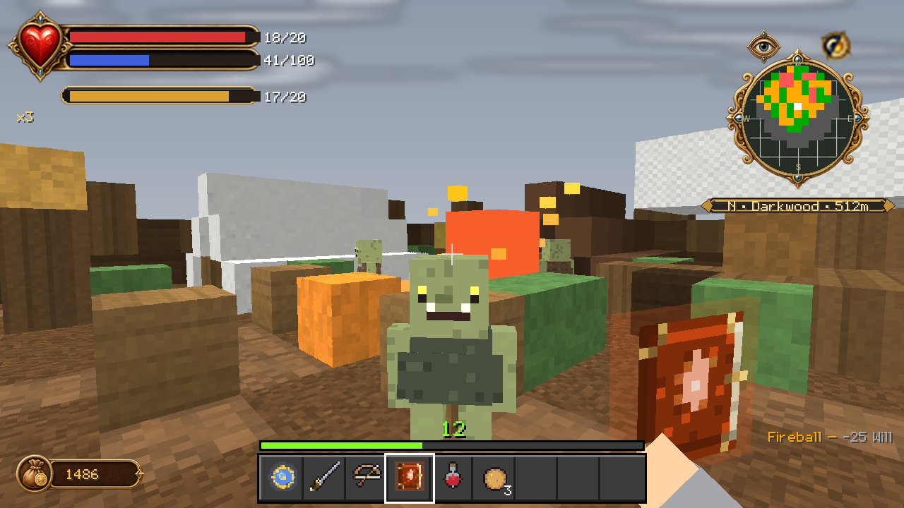

# Will

Eighteen Will powers, a regenerating Will pool, a three-slot quick-cast bar and
a hold-to-charge system. Six of the eighteen are gated by alignment — three
each way — so no single Hero can hold the whole book at once.

---

## The Will pool

Will is the blue bar in the HUD's status frame, separate from health and
stamina. It regenerates on its own at roughly **4 points per second** and is
independent of Minecraft's hunger or XP.

Casting spends Will. Every power also has its own cooldown, measured in ticks
(20 ticks = 1 second), so burst damage is limited by the cooldown and sustained
casting is limited by the pool.

---

## The book

| Power | Will | Cooldown | Alignment | What it does |
|---|---:|---:|:---:|---|
| **Assassin Rush** | 8 | 2.0s | — | Blink behind your target in a streak of shadow |
| **Force Push** | 10 | 2.3s | — | A telekinetic blast hurls enemies away |
| **Multi Arrow** | 10 | 3.0s | — | Your next volley splits into a fan of arrows |
| **Fireball** | 12 | 1.5s | — | Hurl an explosive sphere of flame |
| **Physical Shield** | 12 | 5.0s | — | A shell of Will absorbs harm while your energy lasts |
| **Multi Strike** | 12 | 6.0s | — | Briefly strike with impossible speed |
| **Lightning** | 14 | 1.8s | — | Arc lightning leaps between your foes |
| **Battle Charge** | 14 | 4.0s | — | Charge forward, smashing all in your path |
| **Enflame** | 15 | 2.5s | — | A ring of fire erupts around the Hero |
| **Ghost Sword** | 16 | 4.5s | — | Summon ethereal blades to fight at your side |
| **Drain Life** | 16 | 3.0s | **Evil** | Steal the life of those around you (−5 morality per cast) |
| **Heal Life** | 18 | 3.0s | **Good** | Convert Will energy into vitality |
| **Turncoat** | 18 | 8.0s | — | Bend an enemy's mind to fight for you |
| **Slow Time** | 20 | 10.0s | — | The world crawls. You do not. |
| **Berserk** | 20 | 12.0s | **Evil** | Rage swells your body and dims your mind |
| **Summon** | 25 | 10.0s | **Good** | Call a creature to fight at your side |
| **Divine Fury** | 35 | 15.0s | **Good** | Holy radiance sears the wicked |
| **Infernal Wrath** | 35 | 15.0s | **Evil** | Darkness devours all around you |

Six powers are locked to an alignment. **Heal Life**, **Summon** and **Divine
Fury** need light; **Drain Life**, **Berserk** and **Infernal Wrath** need dark.
The two capstones, Divine Fury and Infernal Wrath, are the same slot on opposite
ends of the scale — which one you can cast is decided by how you have played.
Drain Life also costs you 5 morality every time you use it, so leaning on it
keeps you where it needs you.

---

## Casting

**Quick-cast.** Three slots, assigned from the **Magic** page of the storybook
menu. Crouch-use cycles the active slot; use casts it.

**Hold to charge.** Holding the cast input builds charge levels at one level
every 8 ticks, capped at 40 ticks of hold. Higher charge means a stronger cast.
Charging is on by default and can be turned off if you prefer instant casts.

**Upgrading.** Spend **150 Will XP per level** to deepen a power. Upgrades are
bought from the Magic page.

---

## Companions

Three powers put something on the field that keeps fighting for you.

**Ghost Sword** summons persistent ethereal blades that pick their own targets.

**Summon** (good Heroes only) calls a creature to fight beside you. You may
hold **two living summons at once**; casting at the cap replaces the oldest. A
summon that kills a foe is refreshed by the fallen soul, so a summon that keeps
winning keeps living.

**Turncoat** charms an enemy into fighting for you for about a minute, scaling
with the power's level. The conversion takes about three seconds of maintained
link. Bosses and quest-critical entities can never be charmed.

Manual verification notes for the companion powers are in
[SPELL_COMPANIONS.md](../SPELL_COMPANIONS.md).

---

## Slow Time

Slow Time is the signature power and the one with the most caveats. In
single-player it does what it says. **It does not affect other players** — that
is hard-disabled, because slowing another person's client is not something a
server-side script should do. In multiplayer it slows the world around everyone
and leaves the players alone.

---

## The Will Focus

The Will Focus is a modular casting instrument, granted on first join. It is
attuned from the **Magic** page and is one of the few items jail cannot take
from you — along with your Guild Seal, your spell tomes and your progression.

Legacy Will tomes still work and are managed from the same page.

---

## Appearance

Casting changes how you look. An overlay rig tracks your alignment tier and
your recent casting, adding auras, horns, halos and other effects on top of
your skin rather than replacing it. Detail can be dialled from **full** down to
**overlays only** or **horns and halo only** if the rig costs you frames.

Terrain-altering spell effects are **off** by default — Will powers will not
rewrite your world's blocks.
